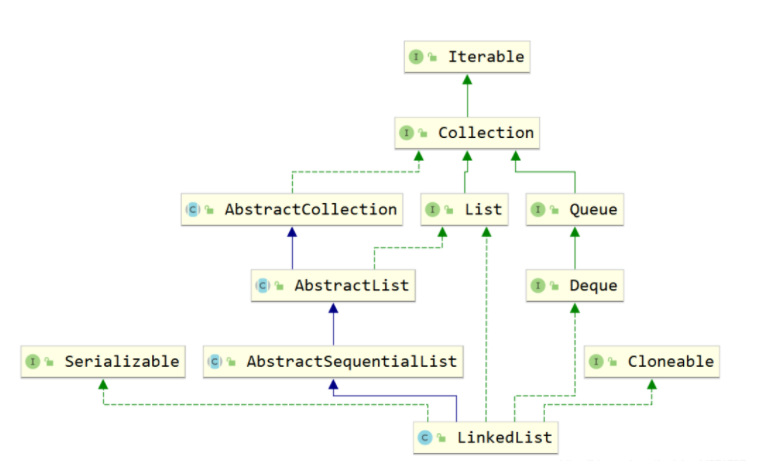

# Java集合


集合类存放于Java.util包中，主要有三种：Set，List（包含Queue）和map

1. Collection：是list，set，queue的最基本的接口
2. Iterator：迭代器，通过迭代器遍历集合中的数据
3. Map：映射表的基础接口，「Map并不继承自Collection接口」


## 顶层接口 Iterable&Collection


```java
//支持lambda函数接口
import java.util.function.Consumer;
public interface Iterable<T> {
  //iterator()方法
    Iterator<T> iterator();
    default void forEach(Consumer<? super T> action) {
        Objects.requireNonNull(action);
        for (T t : this) {
            action.accept(t);
        }
    }
    default Spliterator<T> spliterator() {
        return Spliterators.spliteratorUnknownSize(iterator(), 0);
    }
}
```


Iterable接口中只有`iterator()`一个接口方法

Iterator也是一个接口，其主要有如下两个方法hasNext()和next()方法。


```java
package java.util;
import java.util.function.Predicate;
import java.util.stream.Stream;
import java.util.stream.StreamSupport;
public interface Collection<E> extends Iterable<E> {
    int size();
    boolean isEmpty();
    boolean contains(Object o);
    Iterator<E> iterator();
    Object[] toArray();
    boolean add(E e);
    boolean remove(Object o);
    boolean containsAll(Collection<?> c);
    boolean removeAll(Collection<?> c);
    default boolean removeIf(Predicate<? super E> filter) {
        Objects.requireNonNull(filter);
        boolean removed = false;
        final Iterator<E> each = iterator();
        while (each.hasNext()) {
            if (filter.test(each.next())) {
                each.remove();
                removed = true;
            }
        }
        return removed;
    }
    boolean retainAll(Collection<?> c);
    void clear();
    int hashCode();
    @Override
    default Spliterator<E> spliterator() {
        return Spliterators.spliterator(this, 0);
    }
    default Stream<E> stream() {
        return StreamSupport.stream(spliterator(), false);
    }
    default Stream<E> parallelStream() {
        return StreamSupport.stream(spliterator(), true);
    }
}
```

Collection的主要接口方法有：


## List


List是有序的Collection。Java List一共三个实现类：ArrayList，Vector，LinkedList


```java
package java.util;

import java.util.function.UnaryOperator;
public interface List<E> extends Collection<E> {
    <T> T[] toArray(T[] a);
    boolean addAll(Collection<? extends E> c);
    boolean addAll(int index, Collection<? extends E> c);
    default void replaceAll(UnaryOperator<E> operator) {
        Objects.requireNonNull(operator);
        final ListIterator<E> li = this.listIterator();
        while (li.hasNext()) {
            li.set(operator.apply(li.next()));
        }
    }
    default void sort(Comparator<? super E> c) {
        Object[] a = this.toArray();
        Arrays.sort(a, (Comparator) c);
        ListIterator<E> i = this.listIterator();
        for (Object e : a) {
            i.next();
            i.set((E) e);
        }
    }
    boolean equals(Object o);
    E get(int index);
    E set(int index, E element);
    void add(int index, E element);
    int indexOf(Object o);
    int lastIndexOf(Object o);
    ListIterator<E> listIterator();
    List<E> subList(int fromIndex, int toIndex);
    @Override
    default Spliterator<E> spliterator() {
        return Spliterators.spliterator(this, Spliterator.ORDERED);
    }
}
```

list比Collection多了**添加方法**add，addAll，**查找方法**get，indexOf，set等方法，并且支持index下标操作


---

**Collection 与 List 的区别**

- Collection是**无序**的，不支持索引操作，而List是有序的。Collection**没有顺序的概念**。
- List中Iterator为ListIterator
- List**可以进行排序**，所以List接口支持使用sort方法
- List可以进行排序，所以List接口支持使用sort方法。


----

### ArrayList (数组)


#### ArrayList继承关系


---

#### ArrayList组成

```java
private static final Object[] EMPTY_ELEMENTDATA = {};

private static final Object[] DEFAULTCAPACITY_EMPTY_ELEMENTDATA = {}

//真正存放元素的数组，不会序列化
transient Object[] elementData; // non-private to simplify nested class access

private int size;
```

ArrayList中的transient Object[] elementData，该elementData是真正存放元素的容器，可见ArrayList是基于数组实现的。


----


内部通过数组实现的，允许对元素进行快速**随机**访问。

缺点是每个元素之间不能有间隔，**当数组大小不满足时需要增加存储能力，就要将已经有数组的数据<复制>到<新的存储空间>中，当从ArrayList的中间位置插入或者删除元素时，需要对数组进行「复制、移动」，代价比较高。**

**「适合随机查找和遍历，不适合插入和删除」**

是**「线程不安全」**的，可以使用Collections.synchronizedList方法把你的ArrayList变成一个线程安全的List

**初始容量是「10」**，每次**扩容为原先的「1.5倍」**（更底层的细节先不考虑。。）


---


#### ArrayList 构造函数

```java
public ArrayList(int initialCapacity) {
    if (initialCapacity > 0) {
        this.elementData = new Object[initialCapacity];
    } else if (initialCapacity == 0) {
        this.elementData = EMPTY_ELEMENTDATA;
    } else {
        throw new IllegalArgumentException("Illegal Capacity: "+
                                           initialCapacity);
    }
}
public ArrayList() {
    this.elementData = DEFAULTCAPACITY_EMPTY_ELEMENTDATA;
}
```


- Object[] elementData 是 ArrayList 真正存放数据的数组
- ArrayList支持默认大小构造，和空构造，当空构造的时候存放数据的`Object[] elementData`是一个空数组{}


---

#### ArrayList 添加元素

```java
public boolean add(E e) {
    // size是列表实际元素数量，elementData.length是开的数组的大小
    ensureCapacityInternal(size + 1); // Increments modCount!!
    elementData[size++] = e; 
    return true;
}

//保证空间足够，如空间不足，扩容
private void ensureExplicitCapacity(int minCapacity) {
    modCount++;

    // overflow-conscious code
    if (minCapacity - elementData.length > 0)
        grow(minCapacity);
}
```

ArrayList中有一个modCount的属性，表示**该列表实例修改的次数**。（所有集合中都有modCount这样一个记录修改次数的属性），每次增改添加都会增加一次该ArrayList修改次数，而上边的add(E e)方法是将新元素添加到list尾部。


----

#### ArrayList 扩容

```java
private static int calculateCapacity(Object[] elementData, int minCapacity) {
    // 当初始化的list是一个空 ArrayList的时候，即：「没有指定数组长度」时，会直接扩容到DEFAULT_CAPACITY，该值大小是一个默认值10。而当添加进ArrayList中的元素超过了数组能存放的最大值就会进行扩容。
    if (elementData == DEFAULTCAPACITY_EMPTY_ELEMENTDATA) {
        //DEFAULT_CAPACITY是10
        return Math.max(DEFAULT_CAPACITY, minCapacity);
    }
    return minCapacity;
}
```


```java
private void grow(int minCapacity) {
    // overflow-conscious code
    int oldCapacity = elementData.length;
    // 右移运算，所以是扩容1.5倍
    int newCapacity = oldCapacity + (oldCapacity >> 1);
    if (newCapacity - minCapacity < 0)
        newCapacity = minCapacity;
    if (newCapacity - MAX_ARRAY_SIZE > 0)
        newCapacity = hugeCapacity(minCapacity);
    // minCapacity is usually close to size, so this is a win:
    elementData = Arrays.copyOf(elementData, newCapacity);
}
```


----

#### 数组 copy


**Java无法自己分配空间，是底层C和C++的实现**。

以 C 为例，我们知道 C 中数组是一个指向首部的指针，比如我们 C 语言**对数组进行分配内存**。Java 就是通过 `arraycopy` 这个 **「native 方法」**实现的**数组的复制**

```java
public static native void arraycopy(Object src, int  srcPos,
                                        Object dest, int destPos,
                                        int length);
p = (int *)malloc(len*sizeof(int));
```


这样的好处？

java里的内存是由 jvm 管理的，而**<u>数组是分配的连续内存</u>**，**<u>而arrayList不一定是连续内存</u>**，当然jvm会帮我们做这样的事，jvm会有内部的优化，会在后续的例子中结合问题来说明。


----

#### **elementData用transient修饰？**


1. transient 的作用是该属性**不参与序列化**
2. ArrayList 继承了标识序列化的Serializable接口
3. 对 ArrayList 序列化的过程中进行了**「读写安全控制」**


#### 如何实现序列化安全的？

```java
private void writeObject(java.io.ObjectOutputStream s)
    throws java.io.IOException{
    // Write out element count, and any hidden stuff
    int expectedModCount = modCount;
    s.defaultWriteObject();

    // Write out size as capacity for behavioural compatibility with clone()
    // 先用默认写方法，然后将size写出
    s.writeInt(size);

    // Write out all elements in the proper order.
    // 遍历写出 elementData，因为该变量是transient修饰的，所以进行手动写出，这样它也会被序列化了。
    for (int i=0; i<size; i++) {
        s.writeObject(elementData[i]);
    }

    if (modCount != expectedModCount) {
        throw new ConcurrentModificationException();
    }
}

/**
 * Reconstitute the <tt>ArrayList</tt> instance from a stream (that is,
 * deserialize it).
 */
private void readObject(java.io.ObjectInputStream s)
    throws java.io.IOException, ClassNotFoundException {
    elementData = EMPTY_ELEMENTDATA;

    // Read in size, and any hidden stuff
    s.defaultReadObject();

    // Read in capacity
    s.readInt(); // ignored

    if (size > 0) {
        // be like clone(), allocate array based upon size not capacity
        int capacity = calculateCapacity(elementData, size);
        SharedSecrets.getJavaOISAccess().checkArray(s, Object[].class, capacity);
        ensureCapacityInternal(size);

        Object[] a = elementData;
        // Read in all elements in the proper order.
        for (int i=0; i<size; i++) {
            a[i] = s.readObject();
        }
    }
}
```


那么先设置elementData不参与序列化，然后又手动写出进行序列化，是不是「**多此一举**」？

```java
protected transient int modCount = 0;
```

modCount是记录list修改的次数的

当写入完之后如果发现**修改次数和开始序列化前不一致**，就会抛出异常，序列化失败。**保证了序列化过程中是未经修改的数据，保证了序列化安全**

> java集合中都是这样实现


### Vector（数组实现，线程同步）


也是通过数组实现的，不同的是 **它「支持线程的同步，是线程安全的，synchronized修饰的操作方法」，即某一时刻只有一个线程能够写Vector**，避免多线程同时写而引起的不一致性，由于实现同步的花费，访问比较慢。。


#### vector组成

和ArrayList基本一样

```java
//存放元素的数组
protected Object[] elementData;

//有效元素数量，小于等于数组长度
protected int elementCount;

//容量增加量，和扩容相关
protected int capacityIncrement;
```


#### Vector扩容


```java
private void grow(int minCapacity) {
    // overflow-conscious code
    int oldCapacity = elementData.length;
    //扩容大小
    int newCapacity = oldCapacity + ((capacityIncrement > 0) ?
                                     capacityIncrement : oldCapacity);
    if (newCapacity - minCapacity < 0)
        newCapacity = minCapacity;
    if (newCapacity - MAX_ARRAY_SIZE > 0)
        newCapacity = hugeCapacity(minCapacity);
    elementData = Arrays.copyOf(elementData, newCapacity);
}
```

当**构造**没有`capacityIncrement`时，一次扩容数组变成原来「两倍」，否则每次增加**capacityIncrement**。


#### Vector移除某一元素


```java
public synchronized E remove(int index) {
    modCount++;
    if (index >= elementCount)
        throw new ArrayIndexOutOfBoundsException(index);
    E oldValue = elementData(index);

    int numMoved = elementCount - index - 1;
    if (numMoved > 0){
        //复制数组，假设数组移除了中间某元素，后边有效值前移1位
        System.arraycopy(elementData, index+1, elementData, index,numMoved);//引用null ，gc会处理
    }
    
    // 数组移除某一元素并且移动后，一定要将原来末尾设为null(使得gc能够回收引用类型的被删除的值)，且有效长度减1。
    elementData[--elementCount] = null; // Let gc do its work

    return oldValue;
}
```


如果移除的不是末尾元素，效率很低，平均每次需要移动一般的元素


---

### LinkedList（链表）


#### 继承关系



LinkedList既是List接口的实现也是Queue的实现（Deque），故其和ArrayList相比LinkedList支持的功能更多，其可视作队列来使用


#### LinkedList的结构 Node


```java
transient Node<E> first;

/**
 * Pointer to last node.
 * Invariant: (first == null && last == null) ||
 * (last.next == null && last.item != null)
 */
transient Node<E> last;
```

LinkedList由一个头节点和一个尾结点组成，分别**指向链表的头部和尾部**


Node结构，由当前值item，和指向上一个节点prev和指向下个节点next的指针组成。

并且**只含有一个构造方法，按照(prev, item, next)这样的参数顺序构造。**

```java
private static class Node<E> {
    E item;
    Node<E> next;
    Node<E> prev;

    Node(Node<E> prev, E element, Node<E> next) {
        this.item = element;
        this.next = next;
        this.prev = prev;
    }
}
```


LinkedList由一个头节点、一个尾结点和一个末尾为0的size构成，组成双向链表

```java
transient int size = 0;

transient Node<E> first;

transient Node<E> last;

public LinkedList() {
}
```


头插法linkFirst和尾插法linkLast

```java
/**
 * Links e as first element. 头插法
 */
private void linkFirst(E e) {
    final Node<E> f = first;
    // 插到头节点first前面
    final Node<E> newNode = new Node<>(null, e, f);
    first = newNode;
    if (f == null)
        last = newNode;
    else
        // 连接头节点和新节点
        f.prev = newNode;
    size++;
    modCount++;
}

/**
 * Links e as last element. 尾插法
 */
void linkLast(E e) {
    final Node<E> l = last;
    final Node<E> newNode = new Node<>(l, e, null);
    last = newNode;
    if (l == null)
        first = newNode;
    else
        l.next = newNode;
    size++;
    modCount++;
}
```


add方法默认使用尾插法：

```java
public boolean add(E e) {
    linkLast(e);
    return true;
}
```


#### LinkedList查询方法


get方法，获取第index个节点

```java
public E get(int index) {
    checkElementIndex(index);
    // 使用for循环遍历
    return node(index).item;
}
```


`node(index)方法`：

```java
Node<E> node(int index) {
    // assert isElementIndex(index);
    //判断index更靠近头部还是尾部,靠近哪段从哪段遍历获取值。 
    if (index < (size >> 1)) {
        Node<E> x = first;
        for (int i = 0; i < index; i++)
            x = x.next;
        return x;
    } else {
        Node<E> x = last;
        for (int i = size - 1; i > index; i--)
            x = x.prev;
        return x;
    }
}
```


查询索引修改方法，先找到对应节点，将新的值替换掉老的值。

```java
public E set(int index, E element) {
    checkElementIndex(index);
    Node<E> x = node(index);
    E oldVal = x.item;
    x.item = element;
    return oldVal;
}
```

**ArrayList随机访问比LinkedList快**

LinkedList要**遍历找到该位置**才能进行修改，而ArrayList是内部数组操作会更快。


> 使用链表结构存储数据，很适合数据的动态插入和删除，随机访问和遍历速度比较慢。
>
> 提供了List接口中没有定义的方法，用于操作表头和表尾元素，***可以当做堆栈、队列和双向队列使用***
>


### Stack


Stack也是List接口的实现类之一，和Vector一样，**<u>因为性能原因</u>**，更主要在开发过程中很少用到栈这种数据结构，不过栈在计算机底层是一种非常重要的数据结构，下边将探讨下Java中Stack。


#### Stack的继承关系


Stack**继承于Vector**，其也是List接口的实现类。

之前提到过Vector是线程安全的，因为其方法都是synchronized修饰的，故此处**Stack从父类Vector继承而来的操作也是线程安全的。**


#### Stack操作


Stack是栈的实现，故其主要操作为push入栈和pop出栈，而栈最大的特点就是LIFO（Last In First Out）


```java
Stack<String> strings = new Stack<>();

strings.push("aaa");
strings.push("bbb");
strings.push("ccc");

System.err.println(strings.pop());
```


#### Stack源码(1.8)


```java
/**
 * Stack源码（Jdk8）
 */
public
class Stack<E> extends Vector<E> {
    public Stack() {
    }
    
    //入栈，使用的是Vector的addElement方法。
    public E push(E item) {
        addElement(item);
        return item;
    }
    
    //出栈，找到数组最后一个元素，移除并返回。
    public synchronized E pop() {
        E obj;
        int     len = size();
        obj = peek();
        removeElementAt(len - 1);
        return obj;
    }
    
    public synchronized E peek() {
        int     len = size();
        if (len == 0)
            throw new EmptyStackException();
        return elementAt(len - 1);
    }
    
    public boolean empty() {
        return size() == 0;
    }
    
    public synchronized int search(Object o) {
        int i = lastIndexOf(o);
        if (i >= 0) {
            return size() - i;
        }
        return -1;
    }
    
    private static final long serialVersionUID = 1224463164541339165L;
}
```


其用的push方法用的是Vector的addElement（E e）方法，该方法是将元素放在集合的尾部

而其pop方法使用的是Vector的`removeElementAt(Index x)`方法，移除并获取**集合的尾部元素**

**可见Stack的操作就是基于线性表的尾部进行操作的。**


#### Stack为什么效率低


JDK1.0 在开发时，可能为了快速的推出一些基本的数据结构操作，所以推出了一些比较粗糙的类。比如，Vector、Stack、Hashtable等。

这些类中的一些方法加上了 synchronized 关键字

基于 Vector 实现的栈 Stack。**「底层实际上还是数组」**，所以还是存在需要**「扩容」**。Vector 是由数组实现的集合类，它包含了大量集合处理的方法。

而 Stack 之所以继承 Vector，是为了**复用 Vector 中的方法**，来实现进栈(push)、出栈(pop)等操作。

:warning: 这里就是 Stack 设计不好的地方，既然只是为了实现栈，**不用链表来单独实现**，而是为了复用简单的方法而迫使它继承 Vector，Stack 和 Vector 本来是毫无关系的。

这使得 **Stack 在基于数组实现上效率受影响**，另外因为继承 Vector 类，Stack 可以复用 Vector 大量方法，这使得 Stack 在设计上不严谨。


----

Java 提供了 **「Deque」** 。Deque 是继承自 Queue，而 Stack 是继承自 Vector。Java 中的 Deuqe，即「“double ended queue”」的缩写，是 Java 中的**双端队列**集合类型。Deque 具备普通队列 FIFO 的功能，同时它也具备了 Stack 的 LIFO 功能，并且保留了 push 和 pop 函数，所以使用起来应该是一点障碍都没有。

**现在推荐这么使用栈结构（双向链表）：**

```
LinkedList<E> stack = new LinkedList<>();
stack.push() & pop() / addLast() & removeLast() / 
```


----

另一种用数组实现的栈结构

ArrayDeque 是 Deque 接口的一种具体实现，是依赖于可变数组来实现的。**ArrayDeque 没有容量限制**，可根据需求**自动进行扩容**。ArrayDeque **可以作为栈来使用**，效率要高于 Stack。ArrayDeque **也可以作为队列来使用**，效率**相较于基于双向链表的 LinkedList 也要更好一些**。

> 注意，ArrayDeque 不支持为 null 的元素。
> 


## Queue


queue是一种先进先出的数据结构，fifo。

可以将queue看作一个只可以从某一段放元素进去的一个容器，取元素只能从另一端取，整个机制如下图所示，不过需要注意的是，队列并没有规定是从哪一端插入，从哪一段取出。


### Queue接口


**Java中明确尾部插入，头部取出**


```java
package java.util;

public interface Queue<E> extends Collection<E> {
     //集合中插入元素
    boolean add(E e);
    
    //队列中插入元素
    boolean offer(E e);
    
    //移除元素，当集合为空，抛出异常
    E remove();
    
    //移除队列头部元素并返回，如果为空，返回null
    E poll();
    
    //查询集合第一个元素，如果为空，抛出异常
    E element();
    
    //查询队列中第一个元素，如果为空，返回null
    E peek();
}
```


**队列的操作不会因为队列为空抛出异常，而集合的操作是队列为空抛出异常。**

集合的操作（基本的操作：add / remove...）：


### Deque接口


```java
package java.util;

public interface Deque<E> extends Queue<E> {
  //deque的操作方法
    void addFirst(E e);
    void addLast(E e);
    boolean offerFirst(E e);
    boolean offerLast(E e);
    E removeFirst();
    E removeLast();
    E pollFirst();
    E pollLast();
    E getFirst();
    E getLast();
    E peekFirst();
    E peekLast();

    boolean removeFirstOccurrence(Object o);
    boolean removeLastOccurrence(Object o);
    // *** Queue methods ***
    boolean add(E e);
    boolean offer(E e);
    E remove();
    E poll();
    E element();
    E peek();
    
    // 省略一堆stack接口方法和collection接口方法
}
```

和Queue中的方法一样，方法名多了First或者Last，First结尾的方法即从头部进行操作，Last即从尾部进行操作。


#### Queue, Deque 的实现类


Java中关于Queue的实现主要用的是双端队列 -> 操作方便自由


- AbstractQueue是Queue的抽象实现类，PriorityQueue是AbstractQueue的继承类
- Deque是Queue的接口继承类，Deque在java.util中主要有`ArrayDeque`和`LinkedList`两个实现类，两者一个是基于**数组**的实现，一个是基于**链表**的实现。


### PriorityQueue


**PriorityQueue默认是「小顶堆」**

源码：

```java
private void siftUpComparable(int k, E x) {
    Comparable<? super E> key = (Comparable<? super E>) x;
    while (k > 0) {
        int parent = (k - 1) >>> 1;
        Object e = queue[parent];
        // 新元素大于/等于旧元素的情况下，堆不再变换位置，sift结束。那么默认就是小顶堆
        if (key.compareTo((E) e) >= 0)
            break;
        queue[k] = e;
        k = parent;
    }
    queue[k] = key;
}

//Integer实现的Comparable的方法compareTo()-> compare()
public int compareTo(Integer anotherInteger) {
    return compare(this.value, anotherInteger.value);
}
public static int compare(int x, int y) {
    return (x < y) ? -1 : ((x == y) ? 0 : 1);
}
```


----

自己定义一个类，并实现Comparable接口：

```java
// 必须实现Comparable方法，String、数值本身即可比较
private static class Test implements Comparable<Test>{
    private int a;
    public Test(int a) {
        this.a = a;
    }
    public int getA() {
        return a;
    }
    public void setA(int a) {
        this.a = a;
    }
    @Override
    public String toString() {
        return "Test{" +
                "a=" + a +
                '}';
    }

    @Override
    public int compareTo(Test o) {
        return 0;
    }
}

public static void main(String[] args) {
    PriorityQueue<Test> queue = new PriorityQueue<>();
    queue.add(new Test(20));queue.add(new Test(14));queue.add(new Test(21));queue.add(new Test(8));queue.add(new Test(9));
    queue.add(new Test(11));queue.add(new Test(13));queue.add(new Test(10));queue.add(new Test(12));queue.add(new Test(15));
    while (queue.size()>0){
        Test poll = queue.poll();
        System.err.print(poll+"->");
    }
}
```

上述代码重写了compareTo方法都返回0，即不做优先级排序。

**返回的顺序为**

```
Test{a=20}->Test{a=15}->Test{a=12}->Test{a=10}->Test{a=13}->Test{a=11}->Test{a=9}->Test{a=8}->Test{a=21}->Test{a=14}
```

和放入的顺序还是不同，所以这儿需要注意在实现Comparable接口的时候一定要按照一定的规则进行优先级排序，**关于为什么取出来的顺序和放入的顺序不一致后边将从源码（移除元素时调整堆）来分析。**


#### PriorityQueue组成


```java
/**
 * 默认容量大小，数组大小
 */
private static final int DEFAULT_INITIAL_CAPACITY = 11;

/**
 * 存放元素的数组
 */
transient Object[] queue; // non-private to simplify nested class access

/**
 * 队列中存放了多少元素
 */
private int size = 0;

/**
 * 自定义的比较规则，有该规则时优先使用，否则使用元素实现的Comparable接口方法。
 */
private final Comparator<? super E> comparator;

/**
 * 队列修改次数，每次存取都算一次修改
 */
transient int modCount = 0; // non-private to simplify nested class access
```

riorityQueue的组成很简单，主一个**存放元素的数组**，和一个**Comparator比较器**。


#### PriorityQueue操作方法源码


---

offer()方法

```java
public boolean offer(E e) {
    if (e == null)
        throw new NullPointerException();
    modCount++;
    int i = size;
    if (i >= queue.length)
        grow(i + 1);
    size = i + 1;
    //i=size，当queue为空的时候
    if (i == 0)
        queue[0] = e;
    else
        siftUp(i, e);
    return true;
}
```

- 当Queue中为空的时候，第一次放入的元素直接放在了数组的第一位，那么上边**案例二**中第一个放入的20就在数组的第一位。
- 当queue中不为空时，又使用**siftUp(i, e)**方法，传入的参数是队列中**已有元素数量** 和 **即将要放入的新元素**


---

siftUp(i, e)

```java
private void siftUp(int k, E x) {
    if (comparator != null)
        siftUpUsingComparator(k, x);
    else
        siftUpComparable(k, x);
}
```


PriorityQueue的组成，是一个**存放元素的数组**，和一个**「Comparator比较器」**。

这儿是指当没有Comparator是**使用元素类实现compareTo方法进行比较**。

其含义为**优先使用「自定义」的比较规则**Comparator，否则**使用「元素所在类」实现的Comparable接口方法**。

元素所在类：Test implements Comparable< Test >

```java
private void siftUpComparable(int k, E x) {
    Comparable<? super E> key = (Comparable<? super E>) x;
    while (k > 0) {
        //为什么-1（因为从0开始）， 思考数组位置0，1，2。0是1和2的父节点。需要使得通过左右子节点都能找到父节点
        int parent = (k - 1) >>> 1;
        //父节点
        Object e = queue[parent];
        //当传入的新节点大于等于父节点则不做处理，否则二者交换
        if (key.compareTo((E) e) >= 0)
            break;
        // 传入的新节点小于父节点，将父节点换到当前位置，继续向父节点的父节点比较，上升
        queue[k] = e;
        k = parent;
    }
    queue[k] = key;
}
```

> 如果堆的根节点下标从1开始，那么：
>
> - 父节点：x 
> - 左子节点：x * 2
> - 右子节点：x * 2 + 1
>
> 如果堆的根节点下标从0开始，那么：
>
> - 父节点：x 
> - 左子节点：x * 2 + 1
> - 右子节点：左子节点 + 1 / x * 2 + 2

当PriorityQueue不为空时插入一个新元素，会对其新元素进行堆排序处理（**对于堆排序此处不做描述**），这样每次进来都会对该元素进行堆排序运算

这样也就保证了Queue中第一个元素永远是最小的（**默认规则排序**）。


----

poll()方法

```java
public E poll() {
    if (size == 0)
        return null;
    int s = --size;
    modCount++;
    E result = (E) queue[0];
    //s = --size,即原来数组的最后一个元素
    E x = (E) queue[s];
    queue[s] = null;
    if (s != 0)
        // 堆的 0位置 是空的，需要换一个「最小的」元素到0位置！x是队列最后一个元素。
        siftDown(0, x);
    return result;
}
```

当取出一个值进行了siftDown操作，**传入的参数为索引0和队列中的最后一个元素**。

> 进行poll()操作后，最小的元素一定是1/2位置
>
> 最好的**调整方式**是：将最后一个元素替补上来，逐步向堆的下层调整到合适位置

```java
private void siftDownComparable(int k, E x) {
    Comparable<? super E> key = (Comparable<? super E>)x;
    int half = size >>> 1; // loop while a non-leaf
    while (k < half) {
        //k的左子节点
        int child = (k << 1) + 1; // assume left child is least
        Object c = queue[child];
        //k的右子节点
        int right = child + 1;
        if (right < size &&
          // c和right是parent的两个子节点，找出小的那个成为新的c。
            ((Comparable<? super E>) c).compareTo((E) queue[right]) > 0){
            // 如果左子节点更大，那就需要将右子节点换到根上，那么key也将替换到右子树上
            // c是右子节点，即：左右子节点中小的那个
            c = queue[child = right];
        }
        // key本身就小于等于c，那么直接将k放到这位置上（可以证明：这个位置和k不在一条连向根节点的线上,因为这条线上key一定是最小的）
        /*
        			1(2)
        		  3    2(6)
        		5  4  9  10
        	   6(x)
        	   或
        			1(2)
        		  2(4)    3
        		5  4(6)  9  10
        	   6(x)
        /*
        if (key.compareTo((E) c) <= 0)
            break;
        //小的子节点变成了新的父节点
        queue[k] = c;
        // 继续向下比较，直到为key找到合适的位置
        k = child;
    }
    queue[k] = key;
}
```


### ArrayDeque


#### ArrayDeque的继承关系


可见ArrayDeque是Deque接口的实现

和LinkedList不同的是，**LinkedList既是List接口也是Deque接口的实现**。


#### ArrayDeque组成


```java
//具体存放元素的数组，数组大小一定是2的幂次方(后面会用到&操作)
transient Object[] elements; // non-private to

//队列头索引
transient int head;

//队列尾索引
transient int tail;

//默认的「最小」初始化容量，即传入的容量小于8容量为8，而默认容量是16
private static final int MIN_INITIAL_CAPACITY = 8;

public ArrayDeque() {
    elements = new Object[16];
}
```


#### 数组elements长度


此处elements数组的**长度永远是2的幂次方**，此处的实现方法和hashMap中基本一样，即保证长度的二进制全部由1组成，然后再加1，则变成了100…，故一定是2的幂次方。

```java
public ArrayDeque(int numElements) {
    allocateElements(numElements);
}

private void allocateElements(int numElements) {
    elements = new Object[calculateSize(numElements)];
}
// 计算需要分配的elements数组长度
// 
private static int calculateSize(int numElements) {
    int initialCapacity = MIN_INITIAL_CAPACITY;
    // Find the best power of two to hold elements.
    // Tests "<=" because arrays aren't kept full.
    // initialCapacity=8
    /*
    作用就是对提供的大小参数，向上取2的幂次作为elements的容量
    initialCapacity |= (initialCapacity >>> 1); 将第二位变成1
    initialCapacity |= (initialCapacity >>> 2); 将前两位(11)和3 、4位或，前四位都是1
    initialCapacity |= (initialCapacity >>> 4); 前四位1 | 4~8位 :前八位都是1
    initialCapacity |= (initialCapacity >>> 8); ...
    initialCapacity |= (initialCapacity >>> 16); ... 32位都是1了
    initialCapacity++; 
    -1(111...1111) >>> 1 = 2147483647
    */
    if (numElements >= initialCapacity) {
        initialCapacity = numElements;
        // 17(10001)
        initialCapacity |= (initialCapacity >>> 1); // 11001
        initialCapacity |= (initialCapacity >>> 2); // 11111
        initialCapacity |= (initialCapacity >>> 4); // 11111
        initialCapacity |= (initialCapacity >>> 8);
        initialCapacity |= (initialCapacity >>> 16);
        initialCapacity++; // 100000 = 32

        if (initialCapacity < 0) // Too many elements, must back off
            initialCapacity >>>= 1;// Good luck allocating 2 ^ 30 elements
    }
    return initialCapacity;
}
```


#### ArrayDeque实现机制


**将数组视为「首尾相连」的**，最初头部和尾部索引都是0，addLast方向往右（从头部开始往右），addFirst方向往左（从尾部开始往左）

所有数组中间可能是空的，当头指针和尾指针**相遇的时候对数组进行扩容**，并对元素位置进行调整


```java
public void addFirst(E e) {
    if (e == null)
        throw new NullPointerException();
    // 加在队列头部，往左边扩
    elements[head = (head - 1) & (elements.length - 1)] = e;
    if (head == tail)
        doubleCapacity();
}
```


```java
// 当 head-1 大于等于0时，head=head-1，否则,head-1=-1(1111...111),head=elements.length - 1。
head = (head - 1) & (elements.length - 1)
```

位运算的神奇操作:zap:：**任何数与大于它的一个全是二进制1做&运算时等于它自身**，如1010&1111 = 1010


----

addLast方法

```java
public void addLast(E e) {
    if (e == null)
        throw new NullPointerException();
    elements[tail] = e;
    // 
    if ( (tail = (tail + 1) & (elements.length - 1)) == head)
        doubleCapacity();
}
```

原理是一个二进制数x(全部由1组成)  和  x+1  做  &  运算  **结果为0**，如`10000&1111 = 0`。

poll方法和add方法逻辑是相反的


## Set


Set注重**「独一无二」**的性质，用于存储**无序**（存入和取出的顺序不一定相同）元素，**值不能重复**。对象的相等性本质是对象的hashcode值（**java是根据对象的内存地址计算出的此序号**）判断的，**如果想要让两个不同的对象视为相等的，就必须覆盖Object的hashCode方法和equals方法**


### Set接口


ava中的Set接口和Colletion是完全一样的定义。

```java
package java.util;
public interface Set<E> extends Collection<E> {
    // Query Operations
    int size();
    boolean isEmpty();
    Object[] toArray();
    <T> T[] toArray(T[] a);
    // Modification Operations
    boolean add(E e);
    boolean remove(Object o);
    boolean containsAll(Collection<?> c);
    boolean addAll(Collection<? extends E> c);
    boolean retainAll(Collection<?> c);
    boolean removeAll(Collection<?> c);
    void clear();
    boolean equals(Object o);
    int hashCode();
    
   	// 此处和Collection接口有区别
    Spliterator<E> spliterator() {
        return Spliterators.spliterator(this, Spliterator.DISTINCT);
    }
}
```


### HashSet（Hash表）


哈希表存放的是哈希值，HashSet存储元素的顺序并不是按照存入时的顺序（和List不同），而是**按照哈希值来存**的所有取数据也是**按照哈希值取**的。元素的哈希值是通过**元素**的**hashcode()方法**来获取的。

HashSet首先判断两个元素的哈希值，如果哈希值一样，接着会比较equals()方法，如果equals()结果为true，HashSet就视为同一个元素，如果equals为false，就不是同一个元素


哈希值相同，但equals为false的元素怎么存储呢？在同样的哈希值下链表形式顺延，哈希一样的存一列

HashSet通过hashCode值来确定元素在内存中的位置，**一个hashCode位置上可以存放多个元素**


```java
public class HashSet<E>
    extends AbstractSet<E>
    implements Set<E>, Cloneable, java.io.Serializable
{
    static final long serialVersionUID = -5024744406713321676L;
    private transient HashMap<E,Object> map;
    private static final Object PRESENT = new Object();
    public HashSet() {
        map = new HashMap<>();
    }
    public HashSet(Collection<? extends E> c) {
        map = new HashMap<>(Math.max((int) (c.size()/.75f) + 1, 16));
        addAll(c);
    }
    public HashSet(int initialCapacity, float loadFactor) {
        map = new HashMap<>(initialCapacity, loadFactor);
    }
    public HashSet(int initialCapacity) {
        map = new HashMap<>(initialCapacity);
    }
    HashSet(int initialCapacity, float loadFactor, boolean dummy) {
        map = new LinkedHashMap<>(initialCapacity, loadFactor);
    }
    public Iterator<E> iterator() {
        return map.keySet().iterator();
    }
    public int size() {
        return map.size();
    }
    public boolean isEmpty() {
        return map.isEmpty();
    }
    public boolean contains(Object o) {
        return map.containsKey(o);
    }
    public boolean add(E e) {
        return map.put(e, PRESENT)==null;
    }
    public boolean remove(Object o) {
        return map.remove(o)==PRESENT;
    }

    public void clear() {
        map.clear();
    }
}

```

**「HashSet内部其实是一个HashMap」**，所有操作


#### HashSet如何保证不重复的呢？


可见HashSet的add方法，插入的值会作为HashMap的key，所以是HashMap保证了不重复。map的put方法新增一个原来不存在的值会返回null，如果原来存在的话会返回原来存在的值。


### TreeSet (二叉树)

使用二叉树的原理对新 add()的对象按照指定的顺序排序，每增加一个对象都会进行排序，**将对象插入到二叉树的指定位置**

Integer和String都可以进行默认的TreeSet排序，自定义类的对象不可以。

**自己定义的类必须实现Comparable接口，并且重写 compareTo()函数**


### LinkedHashSet（HashSet + LinkedHashMap）


**继承HashSet**，**基于「LinkedHashMap」实现**，底层使用LinkedhashMap来**保存所有元素**，继承于HashSet，所有的方法都和HashSet相同，调用父类构造器，底层构造一个LinkedHashMap来实现，操作与父类HashSet相同。


#### LinkedHashSet 源码


```java
package java.util;

public class LinkedHashSet<E>
    extends HashSet<E>
    implements Set<E>, Cloneable, java.io.Serializable {

    private static final long serialVersionUID = -2851667679971038690L;

    public LinkedHashSet(int initialCapacity, float loadFactor) {
      //调用HashSet的构造方法
        super(initialCapacity, loadFactor, true);
    }
    public LinkedHashSet(int initialCapacity) {
        super(initialCapacity, .75f, true);
    }
    public LinkedHashSet() {
        super(16, .75f, true);
    }
    public LinkedHashSet(Collection<? extends E> c) {
        super(Math.max(2*c.size(), 11), .75f, true);
        addAll(c);
    }
    @Override
    public Spliterator<E> spliterator() {
        return Spliterators.spliterator(this, Spliterator.DISTINCT |
Spliterator.ORDERED);
    }
}
```

操作方法和HashSet一样的，区别在哪？


1. **LinkedHashSet中用于存储值的实现是「LinkedHashMap」**，而HashSet使用的是HashMap。

   LinkedHashSet中调用的也是父类HashSet的构造器，可以看到创建了一个LinkedHashMap。

   ```java
   HashSet(int initialCapacity, float loadFactor, boolean dummy) {
       map = new LinkedHashMap<>(initialCapacity, loadFactor);
   }
   ```

   


## Map


### Map接口


```java
package java.util;

import java.util.function.BiConsumer;
import java.util.function.BiFunction;
import java.util.function.Function;
import java.io.Serializable;
public interface Map<K,V> {
    // Query Operations
    int size();
    boolean isEmpty();
    boolean containsKey(Object key);
    boolean containsValue(Object value);
    V get(Object key);
    // Modification Operations
    V put(K key, V value);
    V remove(Object key);
    // Bulk Operations
    void putAll(Map<? extends K, ? extends V> m);
    void clear();
    Set<K> keySet();
    Collection<V> values();
    Set<Map.Entry<K, V>> entrySet();
    
    
    interface Entry<K,V> {
        K getKey();
        
        V getValue();
        
        V setValue(V value);
        
        boolean equals(Object o);
        int hashCode();
        
        public static <K extends Comparable<? super K>, V> Comparator<Map.Entry<K,V>> comparingByKey() {
            return (Comparator<Map.Entry<K, V>> & Serializable)
                (c1, c2) -> c1.getKey().compareTo(c2.getKey());
        }
        public static <K, V extends Comparable<? super V>> Comparator<Map.Entry<K,V>> comparingByValue() {
            return (Comparator<Map.Entry<K, V>> & Serializable)
                (c1, c2) -> c1.getValue().compareTo(c2.getValue());
        }
        public static <K, V> Comparator<Map.Entry<K, V>> comparingByKey(Comparator<? super K> cmp) {
            Objects.requireNonNull(cmp);
            return (Comparator<Map.Entry<K, V>> & Serializable)
                (c1, c2) -> cmp.compare(c1.getKey(), c2.getKey());
        }
        public static <K, V> Comparator<Map.Entry<K, V>> comparingByValue(Comparator<? super V> cmp) {
            Objects.requireNonNull(cmp);
            return (Comparator<Map.Entry<K, V>> & Serializable)
                (c1, c2) -> cmp.compare(c1.getValue(), c2.getValue());
        }
    }

    
    
    // Comparison and hashing
    boolean equals(Object o);
    int hashCode();
    
    
    default V getOrDefault(Object key, V defaultValue) {
        V v;
        return (((v = get(key)) != null) || containsKey(key))
            ? v
            : defaultValue;
    }
    
    
    default void forEach(BiConsumer<? super K, ? super V> action) {
        Objects.requireNonNull(action);
        for (Map.Entry<K, V> entry : entrySet()) {
            K k;
            V v;
            try {
                k = entry.getKey();
                v = entry.getValue();
            } catch(IllegalStateException ise) {
                // this usually means the entry is no longer in the map.
                throw new ConcurrentModificationException(ise);
            }
            action.accept(k, v);
        }
    }
    
    
    default void replaceAll(BiFunction<? super K, ? super V, ? extends V> function) {
        Objects.requireNonNull(function);
        for (Map.Entry<K, V> entry : entrySet()) {
            K k;
            V v;
            try {
                k = entry.getKey();
                v = entry.getValue();
            } catch(IllegalStateException ise) {
                // this usually means the entry is no longer in the map.
                throw new ConcurrentModificationException(ise);
            }

            // ise thrown from function is not a cme.
            v = function.apply(k, v);

            try {
                entry.setValue(v);
            } catch(IllegalStateException ise) {
                // this usually means the entry is no longer in the map.
                throw new ConcurrentModificationException(ise);
            }
        }
    }
    default V putIfAbsent(K key, V value) {
        V v = get(key);
        if (v == null) {
            v = put(key, value);
        }

        return v;
    }
    default boolean remove(Object key, Object value) {
        Object curValue = get(key);
        if (!Objects.equals(curValue, value) ||
            (curValue == null && !containsKey(key))) {
            return false;
        }
        remove(key);
        return true;
    }

    default boolean replace(K key, V oldValue, V newValue) {
        Object curValue = get(key);
        if (!Objects.equals(curValue, oldValue) ||
            (curValue == null && !containsKey(key))) {
            return false;
        }
        put(key, newValue);
        return true;
    }

    default V replace(K key, V value) {
        V curValue;
        if (((curValue = get(key)) != null) || containsKey(key)) {
            curValue = put(key, value);
        }
        return curValue;
    }
    default V computeIfAbsent(K key,
            Function<? super K, ? extends V> mappingFunction) {
        Objects.requireNonNull(mappingFunction);
        V v;
        if ((v = get(key)) == null) {
            V newValue;
            if ((newValue = mappingFunction.apply(key)) != null) {
                put(key, newValue);
                return newValue;
            }
        }

        return v;
    }

    default V computeIfPresent(K key,
            BiFunction<? super K, ? super V, ? extends V> remappingFunction) {
        Objects.requireNonNull(remappingFunction);
        V oldValue;
        if ((oldValue = get(key)) != null) {
            V newValue = remappingFunction.apply(key, oldValue);
            if (newValue != null) {
                put(key, newValue);
                return newValue;
            } else {
                remove(key);
                return null;
            }
        } else {
            return null;
        }
    }


    default V compute(K key,
            BiFunction<? super K, ? super V, ? extends V> remappingFunction) {
        Objects.requireNonNull(remappingFunction);
        V oldValue = get(key);

        V newValue = remappingFunction.apply(key, oldValue);
        if (newValue == null) {
            // delete mapping
            if (oldValue != null || containsKey(key)) {
                // something to remove
                remove(key);
                return null;
            } else {
                // nothing to do. Leave things as they were.
                return null;
            }
        } else {
            // add or replace old mapping
            put(key, newValue);
            return newValue;
        }
    }
    default V merge(K key, V value,
            BiFunction<? super V, ? super V, ? extends V> remappingFunction) {
        Objects.requireNonNull(remappingFunction);
        Objects.requireNonNull(value);
        V oldValue = get(key);
        V newValue = (oldValue == null) ? value :
                   remappingFunction.apply(oldValue, value);
        if(newValue == null) {
            remove(key);
        } else {
            put(key, newValue);
        }
        return newValue;
    }
}
```


### HashMap（数组 + 链表 + 红黑树）


HashMap根据键的hashCode值存储数据，大多数情况下可以直接定位到它的值，**访问速度很快**，遍历顺序却不确定。hashMap最多只允许一条记录的**键为null**，允许多条记录的值为null

**HashMap「非线程安全」**，任一时刻如果有多个线程同时写HashMap，会导致数据不一致。

使用Collections的synchronizedMap方法使HashMap具有线程安全的能力，或者使用ConcurrentHashMap。


#### HashMap存储的数据


Map接口中有一个Entry接口，在HashMap中对其进行了实现，**Entry的实现是HashMap「存放的数据的类型」**。

其中Entry在HashMap的实现是Node，**Node是一个单链表的结构**，TreeNode是其子类，是一个**红黑树**的类型，其继承结构图如下：

```java
static class Node<K,V> implements Map.Entry<K,V>
```


HashMap存放数据的数据是什么呢？

```
transient Node<K,V>[] table;
```

> 说明了该容器中是一个又一个node组成
>
> 而node有三种实现，所以hashMap中存放的node的形式既可以是**Node**也可以是**TreeNode**


#### HashMap的组成


```java
//hashMap的最小容量16，容量就是数组的大小也就是变量，transient Node<K,V>[] table。
static final int DEFAULT_INITIAL_CAPACITY = 1 << 4; // aka 16

//最大数量，该数组最大值为2^31一次方。
static final int MAXIMUM_CAPACITY = 1 << 30;

//默认的加载因子，如果构造的时候不传则为0.75
static final float DEFAULT_LOAD_FACTOR = 0.75f;

// 一个位置里存放的节点转化成红黑树的阈值，也就是8，比如数组里有一个node，这个
// node链表的长度达到该值才会转化为红黑树。
static final int TREEIFY_THRESHOLD = 8;

//当一个反树化的阈值，当这个node长度减少到该值就会从树转化成链表
static final int UNTREEIFY_THRESHOLD = 6;

//满足节点变成树的另一个条件，就是存放node的 数组长度 要达到64
static final int MIN_TREEIFY_CAPACITY = 64;

//具体存放数据的数组
transient Node<K,V>[] table;

//entrySet，一个存放k-v缓冲区
transient Set<Map.Entry<K,V>> entrySet;

//size是指hashMap中存放了多少个键值对
transient int size;

//对map的修改次数
transient int modCount;

//加载因子
final float loadFactor;
```

**table是指的存放数据的数组，bin是指的table中某一个位置的node，一个node可以理解成一批/一盒数据。**


#### 构造函数

```java
//只有容量，initialCapacity
public HashMap(int initialCapacity) {
    this(initialCapacity, DEFAULT_LOAD_FACTOR);
}

public HashMap() {
    this.loadFactor = DEFAULT_LOAD_FACTOR; // all other fields defaulted
}

public HashMap(Map<? extends K, ? extends V> m) {
    this.loadFactor = DEFAULT_LOAD_FACTOR;
    putMapEntries(m, false);
}

final void putMapEntries(Map<? extends K, ? extends V> m, boolean evict) {
    int s = m.size();
    if (s > 0) {
        if (table == null) { // pre-size
            float ft = ((float)s / loadFactor) + 1.0F;
            int t = ((ft < (float)MAXIMUM_CAPACITY) ?
                     (int)ft : MAXIMUM_CAPACITY);
            if (t > threshold)
                threshold = tableSizeFor(t);
        }
        else if (s > threshold)
            resize();
        for (Map.Entry<? extends K, ? extends V> e : m.entrySet()) {
            K key = e.getKey();
            V value = e.getValue();
            putVal(hash(key), key, value, false, evict);
        }
    }
}

public HashMap(int initialCapacity, float loadFactor) {
    if (initialCapacity < 0) // 容量不能为负数
        throw new IllegalArgumentException("Illegal initial capacity: " +
                                           initialCapacity);
    //当容量大于2^31就取最大值1<<31;
    if (initialCapacity > MAXIMUM_CAPACITY)
        initialCapacity = MAXIMUM_CAPACITY;
    if (loadFactor <= 0 || Float.isNaN(loadFactor))
        throw new IllegalArgumentException("Illegal load factor: " +
                                           loadFactor);
    this.loadFactor = loadFactor;
    //当前数组table的大小，一定是是2的幂次方
    // tableSizeFor保证了数组一定是是2的幂次方，是大于initialCapacity最结进的值。
    this.threshold = tableSizeFor(initialCapacity);
}
```

**tableSizeFor()方法保证了数组大小一定是是2的幂次方**

```java
static final int tableSizeFor(int cap) {
    int n = cap - 1;
    n |= n >>> 1;
    n |= n >>> 2;
    n |= n >>> 4;
    n |= n >>> 8;
    n |= n >>> 16;
    return (n < 0) ? 1 : (n >= MAXIMUM_CAPACITY) ? MAXIMUM_CAPACITY : n + 1;
}
```

该方法将一个二进制数的第一位1后边的数字全部变成1，然后再加一，这样这个二进制数就一定是2的幂次。

> 在ArrayDeque的实现中也用到了类似的方法来保证数组长度一定是2的幂次方。


#### put方法


```java
public V put(K key, V value) {
    return putVal(hash(key), key, value, false, true);
}
```

真正HashMap内部使用的put值的方法：

```java
final V putVal(int hash, K key, V value, boolean onlyIfAbsent,
               boolean evict) {
    Node<K,V>[] tab; Node<K,V> p; int n, i;
    
    //插入kv时，表中没有元素了，就新创建一个hashmap
    if ((tab = table) == null || (n = tab.length) == 0)
        n = (tab = resize()).length;
    
    // 当hash到的位置，该位置为null的时候，存放一个新node放入
    // p赋值成了table该位置的node值
    if ((p = tab[i = (n - 1) & hash]) == null)
        tab[i] = newNode(hash, key, value, null);
    
    else {
        Node<K,V> e; K k;
        // 该位置第一个就是查找到的值，将p赋给e
        // 哈希值能匹配，并且key的对象相等/equal
        if (p.hash == hash &&
            ((k = p.key) == key || (key != null && key.equals(k))))
            e = p;
        
        // 第一个位置无法匹配，再看：如果是红黑树，调用红黑树的putTreeVal方法
        else if (p instanceof TreeNode)
            e = ((TreeNode<K,V>)p).putTreeVal(this, tab, hash, key, value);
        else {
            
            // 既不是第一个，也不是红黑树，那么就是链表结构
            // 是链表，遍历，注意e = p.next这个一直将下一节点赋值给e，直到尾部，注意开头是++binCount
            for (int binCount = 0; ; ++binCount) {
                if ((e = p.next) == null) {
                    p.next = newNode(hash, key, value, null);
                    
                    //当链表长度大于等于7，插入第8位，树化
                    if (binCount >= TREEIFY_THRESHOLD - 1) // -1 for 1st
                        treeifyBin(tab, hash);
                    break;
                }
                // 找到了有相同key的值，那就不插入~
                if (e.hash == hash &&
                    ((k = e.key) == key || (key != null && key.equals(k))))
                    break;
                p = e;
            }
        }
        
        // e == null：原先的key不存在，put一定是新加入元素进去了，反之就没有加入元素进去
        if (e != null) { // existing mapping for key
            V oldValue = e.value;
            // 「替换旧值」
            if (!onlyIfAbsent || oldValue == null)
                e.value = value;
            afterNodeAccess(e);
            return oldValue;
        }
    }
    
    // 有新加入的元素后才走到这一步，否则上面已经return
    ++modCount;
    // put新元素后超过阈值，resize()扩容，复制
    if (++size > threshold)
        resize();
    afterNodeInsertion(evict);
    return null;
}
```


#### HashMap中key的比较


```java
(e.hash == hash &&  //hash值必须一样，这一点根据重写的hashCode()方法来确定
((k = e.key) == key || (key != null && key.equals(k))))  // 引用对象是一个对象或者，equal比较的结果一样，都认为是相等的
```


#### 查找方法


```java
final Node<K,V> getNode(int hash, Object key) {
    Node<K,V>[] tab; Node<K,V> first, e; int n; K k;
    
    //先判断表不为空
    if ((tab = table) != null && (n = tab.length) > 0 &&
        //这一行是找到要查询的Key在table中的位置，table是存放HashMap中每一个Node的数组。
        (first = tab[(n - 1) & hash]) != null) {
        //Node可能是一个链表或者树，先判断根节点是否是要查询的key,就是根节点，方便后续遍历Node写法并且
        
        // 1. 对于只有根节点的Node直接判断
        if (first.hash == hash && // always check first node
            ((k = first.key) == key || (key != null && key.equals(k))))
            return first;
        // 2. 有子节点,分为两种情况：红黑树&链表结构
        if ((e = first.next) != null) {
            //红黑树查找
            if (first instanceof TreeNode)
                return ((TreeNode<K,V>)first).getTreeNode(hash, key);
            do {
                //链表查找
                if (e.hash == hash &&
                    ((k = e.key) == key || (key != null && key.equals(k))))
                    return e;
            }
            //遍历链表，当链表后续为null则推出循环
            while ((e = e.next) != null);
        }
    }
    return null;
}
```


#### HashMap的loadFactor为什么是0.75？


### HashTable


和HashMap不同，**HashTable的实现方式完全不同**，这点从二者的类继承关系就可以看出端倪来，HashTable和HashMap虽然都实现了Map接口，但是**HashTable继承了DIctionary抽象类**，而**HashMap继承了AbstractMap抽象类。**


#### Dictionary 抽象类


```java
public abstract
class Dictionary<K,V> {
    public Dictionary() {
    }
    public abstract int size();
    public abstract boolean isEmpty();
    public abstract Enumeration<K> keys();
    public abstract Enumeration<V> elements();
    public abstract V get(Object key);
    public abstract V put(K key, V value);
    
    public abstract V remove(Object key);
}
```

当key为null时会抛出空指针NullPointerException,这也**说明了HashTabel是「不允许Key为null的」**


#### Hashtable组成


```java
/**
 * The hash table data.
 * 真正存放数据的数组
 */
private transient Entry<?,?>[] table;


/**
 * The total number of entries in the hash table.
 */
private transient int count;


/**
 * The table is rehashed when its size exceeds this threshold. (The
 * value of this field is (int)(capacity * loadFactor).)
 * 重新hash的阈值
 * @serial
 */
private int threshold;


/**
 * The load factor for the hashtable.
 * @serial
 */
private float loadFactor;
```

HashTable中的元素存在Entry<?,?>[] table中，是一个Entry数组，Entry是存放的节点，**每一个Entry是一个链表的节点**


#### HashTable中的Entry


```java
private static class Entry<K,V> implements Map.Entry<K,V> {
    final int hash;
    final K key;
    V value;
    Entry<K,V> next;
    
    // Map.Entry Ops...略
}
```

和HashMap中的Node结构相同，但是HashMap中还有Node的子类TreeNode。


#### put方法


```java
public synchronized V put(K key, V value) {
    // Make sure the value is not null 先确定value不为null
    if (value == null) {
        throw new NullPointerException();
    }

    // Makes sure the key is not already in the hashtable.
    Entry<?,?> tab[] = table;
    // 如果key为null，则求hashCode时也会抛异常，不用判断了
    int hash = key.hashCode();
    //在数组中的位置 0x7fffffff 是31位二进制1
    int index = (hash & 0x7FFFFFFF) % tab.length;
    @SuppressWarnings("unchecked")
    Entry<K,V> entry = (Entry<K,V>)tab[index];
    for(; entry != null ; entry = entry.next) {
      //如果遍历链表找到了则替换旧值并返回
        if ((entry.hash == hash) && entry.key.equals(key)) {
            V old = entry.value;
            entry.value = value;
            return old;
        }
    }
	// 没有旧值，新添加一个值进该Entry节点的链表
    addEntry(hash, key, value, index);
    return null;
}
```

1. hash求Entry数组中的索引
2. 遍历该索引Entry链表，如果找到hash值和key都和put的key一样的时候就**替换旧值**，否则使用addEntry方法添加新值进入table

因为添加新元素就涉及到修改元素大小，还可能需要扩容等

```java
private void addEntry(int hash, K key, V value, int index) {
    Entry<?,?> tab[] = table;
    
    //如果扩容，则需要重新计算hash，所以index和table都会被修改
    if (count >= threshold) {
        // Rehash the table if the threshold is exceeded
        rehash();

        tab = table;
        hash = key.hashCode();
        index = (hash & 0x7FFFFFFF) % tab.length;
    }
    
    // Creates the new entry.
    @SuppressWarnings("unchecked")
    //链表头节点
    Entry<K,V> e = (Entry<K,V>) tab[index];
    
    //插入新元素,采用头插法，原头节点e作为新节点的next节点
    tab[index] = new Entry<>(hash, key, value, e);
    count++;
    modCount++;
}
tab[index] = new Entry<>(hash, key, value, e);
```

**「重点：hashtable采用头插法」**


#### get方法


```java
@SuppressWarnings("unchecked")
public synchronized V get(Object key) {
    Entry<?,?> tab[] = table;
    int hash = key.hashCode();
    int index = (hash & 0x7FFFFFFF) % tab.length;
    for (Entry<?,?> e = tab[index] ; e != null ; e = e.next) {
        if ((e.hash == hash) && e.key.equals(key)) {
            return (V)e.value;
        }
    }
    return null;
}
```

get方法就简单很多就是hash，找到索引，遍历链表找到对应的value，没有则返回null


> **HashTable中方法是用synchronized修饰的，所以其操作是线程安全的，但是效率会受影响。**


java7实现：


java8每个元素是Node组成的链表

HashMap里面是一个数组，然后数组中每个元素是一个单向链表。上图中，每个绿色的实体是嵌套类Node的实例，Node包含四个属性，key, hash, value，用于单向链表的next

1.  capacity：当前数组容量，始终保持2^n，可以扩容，扩容后数组大小为当前的2倍
2. loadFactor: 负载因子，默认为0.75
3. threshold：扩容的阈值，等于capacity * loadFactor，占用的空间达到了这个阈值，就对整个capacity进行扩容


java8实现：

java8对HashMap进行了一些修改，**利用了红黑树，所以由  数组 + 链表 + 红黑树组成**

根据hash值可以快速定位到数组的具体下标，需要顺着链表一个个比较下去才能找到我们需要的，时间复杂度取决于链表的长度，为O(n)。

java8中为了降低这部分的复杂度，**当链表中的元素超过了8个以后，会将链表转换为红黑树**，在这些位置进行查找的时候将时间复杂度降低为O(logN)


---

- ConcurrentHashMap


1. Segment段

ConcurrentHashMap和HashMap思路差不多，**但是因为支持并发操作，结构复杂一点**

整个ConcurrentHashMap由一个个Segment组成，Segment代表“部分 / 段”的意思，所以很多地方都会将其描述为**分段锁**。


2. **线程安全（Segment 继承 ReentrantLock加锁）**

简单理解：ConcurrentHashMap 就是一个Segment数组，Segment通过继承ReentrantLock来进行加锁，所以每次需要加锁的操作锁住的是一个Segment，这样**只需要保证每个Segment是线程安全的，就实现了全局的线程安全**


3. 并行度，**默认16**

concurrencyLevell：并行级别、并发数、**Segment数**，默认是16，也就是说ConcurrentHashMap也有**16个Segments**，所以理论上，这个时候，最多可以同时支持16个线程**并发写**，(只要它们的操作分别在不同的Segment上)。

```java
/**
 * The default concurrency level for this table. Unused but
 * defined for compatibility with previous versions of this class.
 */
private static final int DEFAULT_CONCURRENCY_LEVEL = 16;
```

初始化构造的时候可以设置为其他值，但一旦初始化后，是不可以扩容的。就是当前ConcurrentHashMap的initialCapacity


每个Segment很像HashMap，不过需要保证线程安全


java8（引入了红黑树）


---

- HashTable（**线程安全**）

方法都带synchronized，它继承自Dictionary类，并且是线程安全的，任一时间只有一个线程能写HashTable，并发性不如ConcurrentHashMap，因为ConcurrentHashMap引入了**分段锁**。需要线程安全的还是使用ConcurrentHashMap


- TreeMap（可排序）

TreeMap实现SortedMap接口，能够把它保存的记录根据键排序，默认是**按键值**的升序排序，也可以**指定排序的比较器**，

使用 Iterator 遍历TreeMap时，得到的记录是排过序的

如果需要使用排序的映射，建议使用TreeMap

使用TreeMap时，key必须实现Comparable接口或者在构造TreeMap传入自定义的Comparator，否则会报异常~ 


- LinkedHashMap（记录插入顺序）

是HashMap的一个子类，保存了记录的插入顺序，在用Iterator遍历LinkedHashMap时，先得到的记录肯定是先插入的。默认按插入顺序遍历，可以构造时传入true，使用**LRU算法**来遍历，迭代顺序就是*最后访问其条目的顺序*，当get（Object key）时，将最新访问的元素放到双向链表的第一位


# 集合经典题目


## HashSet & HashMap


HashSet是通过HashMap来实现的，HashMap的输入参数有Key、Value两个组成

在**实现HashSet的时候**，保持**HashMap的Value为常量**，相当于在HashMap中只对Key对象进行处理。


---

**HashMap存储对象的过程**

1. 对HashMap的 Key 调用 hashCode() 方法，返回int 值，即：对应的hashCode
2. 把这个hashCode 作为 哈希表的索引，查找其在哈希表中的响应位置。若当前位置内容为null，表明当前没有key散列到这个hashCode上，则把HashMap的Key、Value**包装成Entry数组，放入当前位置**；
3. 若当前位置不为空，则继续查找当前hashCode索引处存放的链表，利用 equals() 方法，找到 Key 相同的 Entry 数组，用当前 Value 去替换旧的 Value
4. 若未找到与当前 Key 值想用的对象，则**把当前位置的链表后移**，**把新的 Entry数组放到链表表头** 

> 在jdk1.8之前是插入头部的，在**jdk1.8中是插入尾部的。**

```java
transient Node<K,V>[] table;

static class Node<K,V> implements Map.Entry<K,V> {
    final int hash;
    final K key;
    V value;
    //Node元素持有对链表中下一个元素的引用
    Node<K,V> next;
    //...
}
```

在jdk1.6中，HashMap中有个内置Entry类，它实现了Map.Entry接口；而在jdk1.8中，这个Entry类不见了，**变成了Node类，也实现了Map.Entry接口**，**与jdk1.6中的Entry是等价的**。


> 为什么要将头插法换成尾插法：
>
> - 解决死循环
>
> - 当时1.7时候用头插是考虑到了一个所谓的**热点数据**的点(**新插入的数据可能会更早用到**)，但这其实是个伪命题,  y因为JDK1.7中rehash的时候，旧链表迁移新链表的时候，如果在新表的数组索引位置相同，则链表元素会倒置(就是因为头插) 所以最后的结果 还是打乱了插入的顺序 所以总的来看支撑1.7使用头插的这点原因也不足以支撑下去了 所以就干脆换成尾插 一举多得


```java
for (int binCount = 0; ; ++binCount) {
    //e是p的下一个节点
    if ((e = p.next) == null) {
        //插入链表的尾部
        p.next = newNode(hash, key, value, null);
        //如果插入后链表长度大于8则转化为红黑树
        if (binCount >= TREEIFY_THRESHOLD - 1) // -1 for 1st
            treeifyBin(tab, hash);
        break;
    }
    //如果key在链表中已经存在，则退出循环
    if (e.hash == hash &&
        ((k = e.key) == key || (key != null && key.equals(k))))
        break;
    p = e;
}
//如果key在链表中已经存在，则修改其原先的key值，并且返回老的值
if (e != null) { // existing mapping for key
    V oldValue = e.value;
    if (!onlyIfAbsent || oldValue == null)
        e.value = value;
    afterNodeAccess(e);
    return oldValue;
}
```


---

**HasSet 存储对象的过程**

往HashSet添加元素的时候，HashSet会先调用元素的hashCode方法得到元素的哈希值 ，

然后通过元素 的哈希值经过移位等运算，就可以算出该元素在哈希表中的存储位置，存储时会出现两种情况：

1. 如果算出元素储存的位置目前没有任何元素存储，那么而直接存储到该位置上
2. 如果该元素的存储位置目前已经存在有其他的元素了，那么会调用该元素的 equals() 方法与该元素再比较一次，如果返回true，那么就是 **重复元素，不允许添加**，如果返回false，那么允许添加·


主要考点有：

- 是否会灵活的使用哈希表解决问题
- 是否熟练掌握哈希表的基本原理
- 哈希冲突解决方法


- HashSet实现了Set接口，其内部不**允许出现重复的值**，如果我们将一个对象存入HashSet，**必须重写equals()和hashCode()方法**，这样才能**确保集合中不存在同一个元素**。HashSet的内部是**无序的**，因此**不能使用 hashset.get(index) 来获取元素**。
- HashMap实现了Map接口，其内容是**键值对的映射**（key->value），不允许出现**相同的键（key）**。在查询的时候会根据给出的键来查询对应的值。
- 我们可以认为，HashSet和HashMap增查操作的时间复杂度都是常数级的。


---

**哈希冲突解决办法**

冲突（Collision），是说两个不同的 key 经过哈希函数的计算后，**得到了两个相同的值**。解决冲突的方法，主要有两种：

- 开散列法（Open Hashing）。是指哈希表所基于的**数组中，每个位置是一个 Linked List 的头结点**。这样冲突的 <key,value> 二元组，就都**放在同一个链表中**。
- 闭散列法（Closed Hashing）是指在发生冲突的时候，后来的元素，**往下一个位置去找空位**。


jdk1.8中String重写的hashCode方法：


## Set专题


### **Set如何保证元素不重复？**


Java的Set体系中，根据实现方式，主要分为两大类：HashSet 和 TreeSet


1. TreeSet **二叉树实现，数据自动排好序**，不续放入null值
2. HashSet 哈希表实现，数据无序，**可以放入一个null**。

二者中的值都不能重复


在HashSet中，基本的操作都是有HashMap底层实现的，因为HashSet底层是用HashMap存储数据的。当向HashSet中添加元素的时候，首先计算元素的hashcode值，然后通过扰动计算和按位与的方式计算出这个元素的存储位置，如果这个位置位空，就将元素添加进去；如果不为空，则用equals方法比较元素是否相等，相等就不添加，否则找一个空位添加。


TreeSet的底层是 TreeMap的keySet, TreeMap是基于红黑树实现的——平衡二叉查找树，保证**任何一个节点的左右子树的高度差不会超过较矮的那棵的一倍**

```java
public TreeSet() {
    this(new TreeMap<E,Object>());
}
```

TreeMap是按key排序的，元素在**插入TreeSet时compareTo()方法要被调用**，所以TreeSet中的元素要**实现Comparable接口**。

TreeSet作为一种Set，它不允许出现重复元素。TreeSet是**用compareTo()来判断重复元素的**。


### HashSet实现原理


基于HashMap，默认初始容量为16， 负载因子为0.75的HashMap。

封装了一个HashMap对象存储所有的集合元素，所有放入HashSet中的集合元素由 HashMap 的 key 来保存，value则存了一个 PRESENT，静态的Object常量对象，**引用不可改变**。

```java
// Dummy value to associate with an Object in the backing Map

private static final Object PRESENT = new Object();
```


若试图将某个类的对象当成HashMap的key，或者放入HashSet中保存时，重写该类的 equals(Object obj) 方法 和  hashCode() 方法，这两个方法的返回值必须保持一致：

***当两个equals() 返回值相同时，通过  hashCode() 方法比较也应该返回  true***


------

获取Set集合的第一个元素

使用迭代器，或传入ArrayList中，toArray方法就使用迭代器遍历集合；


### **Collection工具类中的sort方法如何比较元素？**


Collections工具类的sort方法有两种重载的形式：

1. 要求传入的待排序容器中存放的**对象实现 Comparable 接口**以实现元素的比较
2. 不强制性要求容器中的元素必须可比较，但是要求第二个参数，参数是 **Comparator接口的子类型（重写 compare 方法实现元素的比较）**，相当一个**临时定义的排序规则**，就是通过接口注入比较元素大小的算法，也是对回调模式的应用。


## 1.7 hashmap扩容时死循环问题


