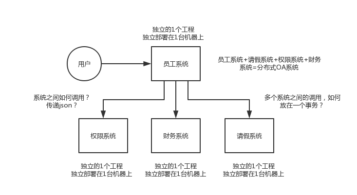
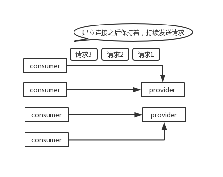
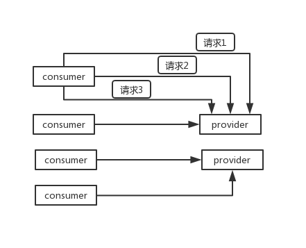
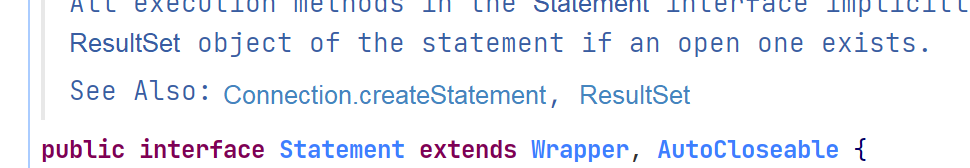
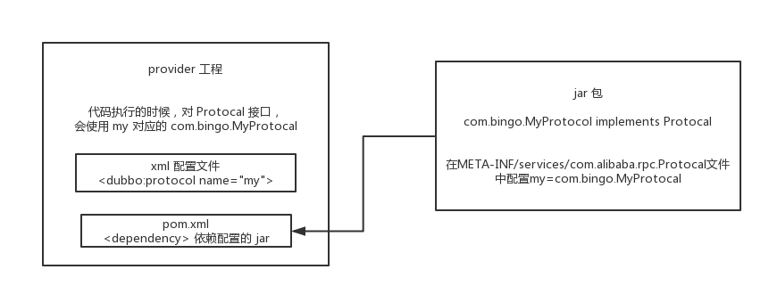
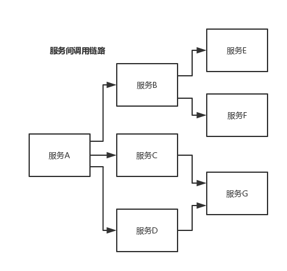
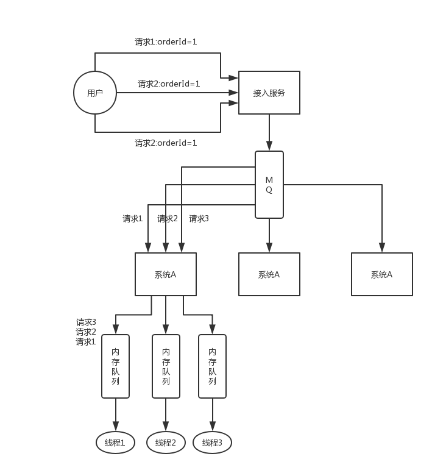

# 分布式系统面试连环炮


现在互联网公司，一般都是做分布式的系统，大家都不是做底层的分布式系统、分布式存储系统 hadoop hdfs、分布式计算系统 hadoop mapreduce / spark、分布式流式计算系统 storm。


**分布式业务系统**，原来用 java 开发的一个大块系统，拆分成 **多个子系统**。多个子系统之间互相调用，形成一个大系统的整体。

---

:chestnut:

假设原来你做了一个 OA 系统，里面包含了权限模块、员工模块、请假模块、财务模块，一个工程，里面包含了一堆模块，模块与模块之间会互相去调用，**1 台机器部署**。

现在如果你把这个系统给拆开，权限系统、员工系统、请假系统、财务系统 **4 个系统**，4 个工程，分别在 4 台机器上部署。一个请求过来，完成这个请求，这个员工系统，调用权限系统，调用请假系统，调用财务系统，4 个系统分别完成了一部分的事情，最后 4 个系统都干完了以后，才认为是这个请求已经完成了。



> 近几年开始兴起和流行 SpringCloud，功能更强大，还没开始普及，目前普及的是 dubbo


---

面试官可能会问这些问题：

- **为什么要进行系统拆分？**如何进行系统拆分？拆分后不用dubbo可以吗？dubbo和thrift有什么区别呢？


**分布式服务框架**

- 说一下 dubbo 的工作原理？注册中心挂了可以继续通信吗？
- dubbo支持哪些序列化协议？说一下 **hessian** 的数据结构？ PB 知道吗？ 为什么 PB 的效率是最高的？
- dubbo 负载均衡策略和高可用策略都有哪些？动态代理策略呢？
- dubbo 的 spi 思想是什么？
- 如何基于 dubbo 进行服务治理、服务降级、失败重试以及超时重试？
- 分布式服务接口的幂等性如何设计（比如不能重复扣款）？
- 分布式服务接口请求的顺序性如何保证？
- 如何自己设计一个类似 dubbo 的 rpc 框架？


**分布式锁**

- 使用 redis 如何设计分布式锁？使用 zk 来设计分布式锁可以吗？这两种分布式锁的实现方式哪种效率比较高？


**分布式事务**

- 分布式事务了解嘛？如何解决分布式事务问题的？TCC如果出现网络连不通怎么办？XA 的一致性如何保证？


**分布式会话**

- 集群部署时的分布式 Session 如何实现？


## 为什么要把系统拆分成分布式的？为啥要用dubbo？


---

**为什么要将系统进行拆分**


1. 要是 **不拆分？** 一个大系统几十万行代码，20 个人维护一份代码，简直是悲剧啊。代码经常改着改着就冲突了，各种代码冲突和合并要处理，非常耗费时间；经常我改动了我的代码，你调用了我的，导致你的代码也得重新测试，麻烦的要死；然后每次发布都是几十万行代码的系统一起发布，大家得一起提心吊胆准备上线，几十万行代码的上线，可能每次上线都要做很多的检查，很多异常问题的处理，简直是又麻烦又痛苦；

   而且如果我现在打算**把技术升级到最新的 spring 版本**，还不行，因为这可能导致你的代码报错，我**<u>不敢随意乱改技术</u>**。

   假设一个系统是 20 万行代码，其中 A 在里面改了 1000 行代码，但是此时发布的时候是这个 **20 万行代码的大系统一块儿发布**。就意味着 20 万上代码在线上就可能出现各种变化，20 个人，每个人都要紧张地等在电脑面前，上线之后，检查日志，看自己负责的那一块儿有没有什么问题。

   A 就检查了自己负责的 1 万行代码对应的功能，确保 ok 就闪人了；结果不巧的是，A 上线的时候不小心修改了线上机器的某个配置，导致另外 B 和 C 负责的 2 万行代码对应的一些功能，出错了。

   几十个人负责维护一个几十万行代码的单块应用，每次上线，准备几个礼拜，上线 -> 部署 -> 检查自己负责的功能。


2. **拆分了以后**，几十万行代码的系统，拆分成 20 个服务，**平均每个服务就 1~2 万行代码，每个服务部署到单独的机器上**。20 个工程，20 个 git 代码仓库，20 个开发人员，每个人维护自己的那个服务就可以了，是自己独立的代码，跟别人没关系。再也没有代码冲突了，爽。**每次就测试我自己的代码就可以了**，爽。**每次就发布我自己的一个小服务就可以**了，爽。技术上想怎么升级就怎么升级，保持接口不变就可以了，真爽。

   所以简单来说，一句话总结，如果是那种代码量多达几十万行的中大型项目，团队里有几十个人，那么如果不拆分系统，**开发效率极其低下**，问题很多。但是拆分系统之后，每个人就负责自己的一小部分就好了，可以随便玩儿随便弄。分布式系统拆分之后，可以**大幅度提升复杂系统大型团队的开发效率**。

   但是同时，也要**提醒**的一点是，系统拆分成分布式系统之后，大量的分布式系统面临的问题也是接踵而来，所以后面的问题都是在**围绕分布式系统带来的复杂技术挑战**在说。


---

**如何进行系统拆分？**


"领域驱动设计"

系统拆分为分布式系统，拆成多个服务，拆成微服务的架构，是需要拆很多轮的。并不是说上来一个架构师一次就给拆好了，而以后都不用拆。

第一轮；团队继续扩大，拆好的某个服务，刚开始是 1 个人维护 1 万行代码，后来业务系统越来越复杂，这个服务是 10 万行代码，5 个人；第二轮，1个服务 -> 5个服务，每个服务 2 万行代码，每人负责一个服务。

如果是多人维护一个服务，最理想的情况下，**几十个人，1 个人负责 1 个或 2~3 个服务；**某个服务工作量变大了，代码量越来越多，某个同学，负责一个服务，代码量变成了 10 万行了，他自己不堪重负，他现在一个人拆开，5 个服务，1 个人顶着，负责 5 个人，接着招人，2 个人，给那个同学带着，3 个人负责 5 个服务，其中 2 个人每个人负责 2 个服务，1 个人负责 1 个服务。

个人建议**，一个服务的代码不要太多，1 万行左右，两三万撑死了吧。**

大部分的系统，是要进行**多轮拆分**的，第一次拆分，可能就是将**以前的多个模块该拆分开来**了，比如说将**电商系统拆分成订单系统、商品系统、采购系统、仓储系统、用户系统**，等等吧。

但是后面可能每个系统又变得越来越复杂了，比如说**采购系统里面又分成了供应商管理系统、采购单管理系统，订单系统又拆分成了购物车系统、价格系统、订单管理系统**。

扯深了实在很深，所以这里先给大家举个例子，你自己感受一下，**核心意思就是根据情况，先拆分一轮，后面如果系统更复杂了，可以继续分拆**。你根据自己负责系统的例子，来考虑一下就好了。


---

**拆分后不用 dubbo 可以吗**


当然可以了，大不了最次，就是各个系统之间，直接基于 spring mvc，就纯 http 接口互相通信呗，还能咋样。但是这个肯定是有问题的，因为 http 接口通信维护起来成本很高，你要考虑**超时重试**、**负载均衡**  等等各种乱七八糟的问题，比如说你的订单系统调用商品系统，商品系统部署了 5 台机器，你怎么把请求均匀地甩给那 5 台机器？这不就是**负载均衡**？你要是都自己搞那是可以的，但是确实很痛苦。

所以 dubbo 说白了，是一种 **rpc 框架**，就是说本地就是进行接口调用，但是 dubbo 会代理这个调用请求，跟**远程机器网络通信，给你处理掉负载均衡、服务实例上下线自动感知、超时重试等等乱七八糟的问题**。那你就不用自己做了，用 dubbo 就可以了。


## dubbo的工作原理？注册中心挂了可以继续通信吗？说说一次 rpc 请求的流程？


既然开始聊**分布式系统**了，自然**重点先聊聊 dubbo** 了，毕竟 dubbo 是目前事实上大部分公司的分布式系统的 rpc 框架标准，基于 dubbo 也可以构建一整套的微服务架构。但是需要自己大量开发。

当然去年开始 spring cloud 非常火，现在大量的公司开始转向 spring cloud 了，spring cloud 人家毕竟是微服务架构的全家桶式的这么一个东西。但是因为很多公司还在用 dubbo，所以 dubbo 肯定会是目前面试的重点，何况人家 dubbo 现在重启开源社区维护了，捐献给了 apache，未来应该也还是有一定市场和地位的。

**既然聊 dubbo，那肯定是先从 dubbo 原理开始聊了，你先说说 dubbo 支撑 rpc 分布式调用的架构啥的，然后说说一次 rpc 请求 dubbo 是怎么给你完成的**


---

**dubbo原理：**

- 第一层：service 层，**接口层**，给服务提供者和消费者来实现的。配好provider和consumer，consumer调用provider的接口。
- 第二层：config 层，**配置层**，主要是对 dubbo 进行各种配置的。任何一个框架都需要提供配置文件，让你可以配置。
- 第三层：proxy 层，**服务代理层**，无论 consumer还是provider，dubbo都会给你**生成代理**，**代理之间进行网络通信**
- 第四层：registry 层，**注册层**，provider注册自己作为一个服务，consumer就可以找注册中心去寻找自己要调用的服务，**负责服务的注册和发现**
- 第五层：cluster 层，**集群层**，封装多个服务提供者的路由以及负载均衡，将多个实例组合成一个服务。provider是可以部署在多台机器上，多个provider组成一个**集群**
- 第六层：monitor 层，**监控层**，consumer 调用 provider，调用了多少次？**统计信息监控**
- 第七层：protocol 层，**远程调用层**，封装 rpc 调用
- 第八层：exchange 层，信息交换层，封装**请求响应模式，同步转异步**
- 第九层：transport 层，网络传输层，抽象 mina 和 netty 为统一接口
- 第十层：serialize 层，数据**序列化层**


---

**工作流程**


- 第一步：provider 向注册中心去注册
- 第二步：consumer 从注册中心订阅服务，注册中心会通知 consumer 注册好的服务
- 第三步：consumer 调用 provider
- 第四步：consumer 和 provider 都异步通知监控中心


consumer调用A的接口，已经知道服务A在哪些机器上了。

N个接口，启动后，dubbo**生成代理**，**服务A的代理监听网络请求**

consumer 端也创建代理，通过**负载均衡**策略来调用服务A集群的接口。 

底层


---

**注册中心挂了可以继续通信吗？**

可以。因为刚开始初始化的时候，消费者会将提供者的地址等信息 **拉取到本地缓存**，所以注册中心挂了可以继续通信


## dubbo 支持哪些通信协议 & 序列化协议？Hessian 的数据结构？PB 的效率是最高的？

dubbo 支持哪些通信协议？支持哪些序列化协议？说一下 Hessian 的数据结构？PB 知道吗？为什么 PB 的效率是最高的？


上一个问题，说说 dubbo 的基本工作原理，那是你必须知道的，至少要知道 dubbo 分成哪些层，然后平时怎么发起 rpc 请求的，注册、发现、调用，这些是基本的。

接着就可以针对底层进行深入的问问了，比如第一步就可以先问问序列化协议这块，就是平时 RPC 的时候怎么走的？


---

**序列化** 就是把数据结构或者是一些对象，转换为二进制串的过程，而**反序列化**是将在序列化过程中所生成的二进制串转换成数据结构或者对象的过程。


---

**dubbo支持不同的通信协议**

- dubbo协议 :star2:

```
dubbo://192.168.0.0.1:20188
这个dubbo就是使用的协议，可以替换
```

默认是走 dubbo 协议的，**单一长连接，进行的是 NIO 异步通信(基于netty，性能很高)，基于 hessian 作为序列化协议。**

:star::star: **适用的场景是：传输数据量小（每次请求在 100kb 以内），但是并发量很高。**

为了要支持高并发场景，一般是服务提供者就几台机器，但是**服务消费者有上百台**，可能每天**调用量达到上亿次**！此时**用长连接是最合适的**，就是跟每个服务消费者维持一个长连接就可以，可能总共就 100 个连接。然后后面直接**基于这 100/1000 个长连接进行 NIO 异步通信**，可以**支撑高并发请求**。


长连接，通俗点说，就是**建立连接过后可以持续发送请求，无须再建立连接**。



而如果是短连接，每次要发送请求之前，需要先**重新建立一次连接**



- rmi 协议

走 Java 二进制序列化，多个短连接，适合消费者和提供者数量差不多的情况，适用于文件的传输，一般较少用。

- hessian 协议

走 hessian 序列化协议，多个短连接，适用于**提供者数量比消费者数量还多的情况**，适用于文件的传输，一般较少用。**dubbo协议只是使用了 hessian 的序列化协议**

- http 协议

走 json 序列化。

- webservice

走 SOAP 文本序列化。


---

**dubbo支持的序列化协议**

dubbo 支持 hession、Java 二进制序列化、json、SOAP 文本序列化多种序列化协议。

**但是 hessian 是其默认的序列化协议。**


---

**Hessian 序列化协议的数据结构**

Hessian 的对象序列化机制有 8 种原始类型：

- 原始二进制数据
- boolean
- 64-bit date （64位毫秒的日期）
- 64-bit **double**
- 32-bit **int**
- 64-bit **long**
- null
- UTF-8 编码的 **string**


另外还包括 3 种递归类型：

- list for lists and arrays
- map for maps and dictionaries
- object for objects


还有一种特殊的类型：

- ref：用来表示**对共享对象的引用。**


---

**为什么 PB 的效率最高？**

Protocol Buffer 是 Google 出品的一种**轻量并且高效的结构化数据存储格式**，性能比 JSON、XML高很多

PB 之所以性能如此好，主要得益于两个：

**第一**，它使用 proto 编译器，自动进行序列化和反序列化，**速度非常快**，应该比 `XML` 和 `JSON` 快上了 `20~100` 倍；

**第二**，它的数据压缩效果好，就是说它序列化后的**数据量体积小**。因为体积小，传输起来带宽和速度上会有优化。


## dubbo 负载均衡策略和集群容错策略(高可用)都有哪些？动态代理策略呢？


说白了，就是看你对 dubbo 熟悉不熟悉：

- dubbo 工作原理：服务注册、注册中心、消费者、代理通信、负载均衡；
- 网络通信、序列化：dubbo 协议、长连接、NIO、hessian 序列化协议；
- 负载均衡策略、集群容错策略、动态代理策略：**dubbo 跑起来的时候一些功能是如何运转的？**怎么做负载均衡？怎么做集群容错？怎么生成动态代理？
- **dubbo SPI 机制**：你了解不了解 dubbo 的 SPI 机制？如何基于 SPI 机制**对 dubbo 进行扩展？**


---

**dubbo负载均衡策略**


- random loadbalance

默认情况下，dubbo 是 random load balance ，即**随机**调用实现负载均衡，可以对 provider 不同实例**设置不同的权重**，会按照权重来负载均衡，权重越大分配流量越高，一般就用这个默认的就可以了。

- roundrobin loadbalance

这个的话默认就是均匀地将流量打到各个机器上去，但是如果各个机器的**性能**不一样，容易导致性能差的机器负载过高。

所以此时需要**调整权重，让性能差的机器承载权重小一些，流量少一些。**

举个:chestnut: 

跟运维同学申请机器，有的时候，我们运气好，正好公司资源比较充足，刚刚有一批热气腾腾、刚刚做好的虚拟机新鲜出炉，配置都比较高：8 核 + 16G 机器，申请到 2 台。过了一段时间，我们感觉 2 台机器有点不太够，我就去找运维同学说，“哥儿们，你能不能再给我一台机器”，但是这时只剩下一台 4 核 + 8G 的机器。我要还是得要。

这个时候，可以**给两台 8 核 16G 的机器设置权重 4，给剩余 1 台 4 核 8G 的机器设置权重 2。**

- leastactive loadbalance

这个就是自动感知一下，如果某个机器性能越差，那么接收的请求越少，越不活跃，此时就会给**不活跃的性能差的机器更少的请求**。

- consistanthash loadbalance

**一致性 Hash 算法**，**相同参数的请求一定分发到一个 provider 上去**

**某个订单id对应的请求必须分发到固定的一台机器上去，非常有用:star::star:**

provider 挂掉的时候，会基于虚拟节点均匀分配剩余的流量，抖动不会太大。**如果你需要的不是随机负载均衡**，是要一类请求都到一个节点，那就走这个一致性 Hash 策略。


---

**dubbo集群容错策略**


- **failover cluster 模式**

失败自动切换，自动重试其他机器，**默认**，常见于读操作

**配置重试次数（这个重试次数是指对同一台机器的重试次数）**

```xml
<dubbo:service retries="2" />
```

```xml
<dubbo:reference retries="2" />
```

```xml
<dubbo:reference>
    <dubbo:method name="findFoo" retries="2" />
</dubbo:reference>
```


- **failfast cluster模式**

**一次调用失败就立即失败**

常见于 **非幂等性的写操作**，比如新增一条记录（调用失败就立即失败）


- **failsafe cluster模式**

**出现异常时忽略掉**，常用于不重要的接口调用，比如记录日志。

配置示例如下：

```xml
<dubbo:service cluster="failsafe" />
```

或者

```xml
<dubbo:reference cluster="failsafe" />
```


- **failback cluster模式**

失败了后台自动记录请求，**然后定时重发，适合写消息队列这种**


- **forking cluster 模式**

**并行调用**多个 provider，只要一个成功就立即返回。常用于**实时性要求比较高的读操作**，但是会浪费更多的服务资源，可通过 `forks="2"` 来**设置最大并行数**。


- **broadcast cluster 模式**

逐个调用所有的 provider。任何一个 provider 出错则报错（从`2.1.0` 版本开始支持）。通常用于通知所有提供者更新缓存或日志等本地资源信息。


---

**dubbo 动态代理策略**

默认使用 javaassist**动态字节码生成**，创建代理类。

> Javassist (JAVA programming ASSISTant) 是在 Java 中**编辑字节码**的类库;它使 Java 程序能够在**运行时定义一个新类**, 并**在 JVM 加载时修改类文件**。
>
> 我们常用到的动态特性主要是**反射**，在运行时查找对象属性、方法，修改作用域，通过方法名称调用方法等。在线的应用不会频繁使用反射，因为**反射的性能开销较大**。其实还有一种和反射一样强大的特性，但是开销却很低，它就是Javassit。
>
> 
>
> https://www.jianshu.com/p/334a148b420a


但可以**通过 spi 扩展机制配置自己的动态代理策略**


## dubbo 的 spi 思想是什么？


---

**spi是啥**

就是 `service provider interface` **服务提供接口**，说白了是什么意思呢，比如你有个接口，现在这个接口有 3 个实现类，那么**在系统运行的时候对这个接口到底选择哪个实现类呢？**

这就需要 spi 了，需要**根据指定的配置**或者是**默认的配置**，去**找到"对应的实现类"**加载进来，然后用这个实现类的实例对象。

举个:chestnut:

你有一个接口 A。A1/A2/A3 分别是接口A的不同实现。你通过配置 `接口 A = 实现 A2`，那么**在系统实际运行的时候，会加载你的配置**，用**实现 A2 实例化一个对象**来提供服务。

比如要通过 jar 包的方式给 **某个接口提供实现**，然后就在自己 jar 包的 META-INF/services/目录下放一个 **跟接口同名的文件**，里面指定接口的实现类是自己这个 jar包里的某个类。别人用了一个接口，然后用了你的 jar包，**就会在运行的时候通过你的 jar 包的那个文件找到这个接口该用哪个实现类**

**这是 jdk 提供的一个功能**


> 比如有一个工程 A，有个接口 A ，接口 A 在工程 A 里是没有实现类的  ——> 系统在运行时，怎么给接口 A 选择一个实现类呢？
>
> 自己搞一个jar包 ，在自己 jar 包的 META-INF/services/目录下放一个 **跟接口同名的文件**，让 工程 A 依赖这个jar包，对接口 A，就会扫描自己以来的所有的 jar包，在每个 jar包里找找，有没有 META-INF/services文件夹，找找有没有接口A这个名字的文件，如果有在里面找接口 A 的实现类是你的 jar包里的哪个类？


spi 机制一般用在哪儿？**插件扩展的场景**，比如说你开发了一个给别人使用的**开源框架**，如果你想让别人自己写个插件，**插到你的开源框架里面，从而扩展某个功能，这个时候 spi 思想就用上了。** 


---

**java spi 思想的体现**


spi 经典的思想体现，大家平时都在用，比如说 **jdbc**。

Java 定义了一套 jdbc 的接口，但是 **Java 并没有提供 jdbc 的实现类**。

但是实际上项目跑的时候，要使用 jdbc 接口的哪些实现类呢？一般来说，我们要**根据自己使用的数据库**，比如 mysql，你就将 `mysql-jdbc-connector.jar` 引入进来；oracle，你就将 `oracle-jdbc-connector.jar` 引入进来。

在系统跑的时候，**碰到你使用 jdbc 的接口**，他会在**底层使用你引入的那个 jar 中提供的实现类。**

`java.sql`包中定义了很多接口如：`Connection, Statement`，但没有实现。




---

**dubbo 的 spi 思想**


dubbo 也用了 spi 思想，不过没有用 jdk 的 spi 机制，是自己实现的一套 spi 机制。

> protocol 层，**远程调用层**，封装 rpc 调用

```java
Protocol protocol = ExtensionLoader.getExtensionLoader(Protocol.class).getAdaptiveExtension();
```

Protocol接口，dubbo 要判断一下，在系统运行的时候，应该选用这个 Protocol接口的哪个实现类来实例化对象来使用呢？

他回去找一个你配置的 Protocol，将你配置的 Protocol 实现类，加载到 jvm中，然后实例化对象，就用那个 Protocol 实现类就可以了

**微内核，可插拔，大量的组件，Protocol负责 rpc 调用的东西，可以实现自己的 rpc 调用组件，只要实现 Protocol 接口，给自己的一个实现类即可**


上面那行代码就是 dubbo 里大量使用的，就是对很多组件，都是**保留一个接口和多个实现**，然后在系统运行的时候**动态根据配置**去找到对应的实现类。如果你没配置，那就走默认的实现好了，没问题。

```java
@SPI("dubbo")  //要求这个接口，通过 SPI机制来提供实现类，这里使用配置的DubboProtocol这个实现类
public interface Protocol {  
      
    int getDefaultPort();  
  
    @Adaptive  //这两个接口方法动态找配置的 Protocol 的实现类，完成这两个方法的调用
    <T> Exporter<T> export(Invoker<T> invoker) throws RpcException;  
  
    @Adaptive  
    <T> Invoker<T> refer(Class<T> type, URL url) throws RpcException;  

    void destroy();  
  
}  
```

在 dubbo 自己的 jar 里，在`/META_INF/dubbo/internal/com.alibaba.dubbo.rpc.Protocol`文件中：

```
dubbo=com.alibaba.dubbo.rpc.protocol.dubbo.DubboProtocol
http=com.alibaba.dubbo.rpc.protocol.http.HttpProtocol
hessian=com.alibaba.dubbo.rpc.protocol.hessian.HessianProtocol
```


这里就看到了 dubbo 的 spi 机制默认是怎么玩的了，其实就是 Protocol 接口，`@SPI("dubbo")` 说的是，通过 SPI 机制来提供实现类，实现类是通过 dubbo 作为默认 key 去配置文件里找到的，配置文件名称与接口全限定名一样的，通过 dubbo 作为 key 可以找到默认的实现类就是 `com.alibaba.dubbo.rpc.protocol.dubbo.DubboProtocol`


如果想要动态替换掉默认的实现类，需要使用 `@Adaptive` 接口，Protocol 接口中，有两个方法加了 `@Adaptive` 注解，就是说那俩接口会被代理实现。

啥意思呢？

比如这个 Protocol 接口搞了俩 `@Adaptive` 注解标注了方法，在运行的时候会**针对 Protocol 生成代理类**，这个代理类的那**俩方法里面会有代理代码**，代理代码会在运行的时候动态根据 url 中的 protocol 来获取那个 key，默认是 dubbo，你也可以自己指定，你如果指定了别的 key，那么就会获取别的实现类的实例了。


---

**如何自己扩展 dubbo 中的组件**


自己写个工程，要是那种可以打成 jar 包的，里面的 `src/main/resources` 目录下，搞一个 `META-INF/services`，里面放个文件叫：`com.alibaba.dubbo.rpc.Protocol`，文件里搞一个配置：

```
my=com.bingo.MyProtocol
```

把 jar 弄到 nexus 私服里去。

然后搞一个 `dubbo provider` 工程，在这个工程里面依赖你自己搞的那个 jar，然后在 spring 配置文件里给个配置：

```xml
<dubbo:protocol name="my" port="20000" />
```


provider 启动的时候，就会**加载到我们 jar 包里的`my=com.bingo.MyProtocol` 这行配置里**，接着会根据你的配置**使用你定义好的 MyProtocol 了**.

这个就是简单说明一下，你通过上述方式，**可以替换掉大量的 dubbo 内部的组件，就是扔个你自己的 jar 包，然后配置一下即可。**



**<u>dubbo 里面提供了大量的类似上面的扩展点</u>**，就是说，你如果要扩展一个东西，只要自己写个 jar，让你的 consumer 或者是 provider 工程，**依赖你的那个 jar**，在你的 jar 里**指定目录下配置好接口名称对应的文件**，里面通过 `key=实现类`。

然后对于对应的组件，类似 `<dubbo:protocol>` **用你的那个 key 对应的实现类来实现某个接口，你可以自己去扩展 dubbo 的各种功能，提供你自己的实现。**

> 见 dubbo 官方文档 **SPI 扩展实现**


## 基于 dubbo 进行服务治理、服务降级、失败重试以及超时重试？


> 服务治理，这个问题如果问你，其实就是看看你有没有**服务治理**的思想，因为这个是做过复杂微服务的人肯定会遇到的一个问题。
>
> **服务降级**，这个是涉及到复杂分布式系统中必备的一个话题，因为分布式系统互相来回调用，任何一个系统故障了，你不降级，直接就全盘崩溃？那就太坑爹了吧。
>
> **失败重试**，分布式系统中网络请求如此频繁，要是因为网络问题不小心失败了一次，是不是要重试？
>
> **超时重试**，跟上面一样，如果不小心网络慢一点，超时了，如何重试？


---

**服务治理**


1. **调用链路自动生成**

一个大型的分布式系统，或者微服务架构，**分布式系统由大量的服务组成**。那么这些服务是如何互相调用的呢？调用链路是啥？服务实在太多了，可能几百个甚至几千个服务，很难搞。

那就需要基于 dubbo 做的分布式系统中，**对各个服务之间的调用自动记录下来**，然后自动将**各个服务之间的依赖关系和调用链路生成出来**，做成一张图，显示出来，才可以看到对吧。




---

**服务访问压力以及时长统计**


自动统计 **各个接口和服务之间的调用次数以及访问延时**，而且要分成两个级别：

- 一个级别是接口粒度，就是每个服务的每个接口每天被调用多少次，TP50/TP90/TP99，三个档次的请求延时分别是多少；
- 第二个级别是从源头入口开始，**一个完整的请求链路**经过几十个服务之后，完成一次请求，每天全链路走多少次，全链路请求延时的 TP50/TP90/TP99，分别是多少。

> TP=Top Percentile，Top百分数，是一个统计学里的术语，与平均数、中位数都是一类。
>
> TP50、TP90和TP99等指标常用于系统性能监控场景，指高于50%、90%、99%等百分线的情况。
>
> **TP指标: TP50：**指在一个时间段内（如5分钟），统计该方法每次调用所消耗的时间，并将这些时间按从小到大的顺序进行排序，取第50%的那个值作为TP50 值；配置此监控指标对应的报警阀值后，需要保证在这个时间段内该方法所有调用的消耗时间**至少有50%的值要小于此阀值，否则系统将会报警**。
>
> **TP90，TP99，TP999**与TP50值计算方式一致，它们分别代表着对方法的不同性能要求，TP50相对较低，TP90则比较高，TP99，TP999则对方法性能要求很高。


搞定这些东西后，**才可以看清当前系统的压力主要在哪里，如何来扩容、优化！**


---

**服务降级**

比如说服务 A 调用服务 B，结果服务 B 挂掉了，服务 A 重试几次调用服务 B，还是不行，那么**直接降级，走一个备用的逻辑，给用户返回响应**。

举个栗子，我们有接口 `HelloService`。`HelloServiceImpl` 有该接口的具体实现。

```java
public interface HelloService {
   void sayHello();
}

public class HelloServiceImpl implements HelloService {
    public void sayHello() {
        System.out.println("hello world......");
    }
}
```


```xml
<?xml version="1.0" encoding="UTF-8"?>
<beans xmlns="http://www.springframework.org/schema/beans"
    xmlns:xsi="http://www.w3.org/2001/XMLSchema-instance" xmlns:dubbo="http://code.alibabatech.com/schema/dubbo"
    xsi:schemaLocation="http://www.springframework.org/schema/beans        http://www.springframework.org/schema/beans/spring-beans.xsd        http://code.alibabatech.com/schema/dubbo        http://code.alibabatech.com/schema/dubbo/dubbo.xsd">

    <dubbo:application name="dubbo-provider" />
    <dubbo:registry address="zookeeper://127.0.0.1:2181" />
    <dubbo:protocol name="dubbo" port="20880" />
    <dubbo:service interface="com.zhss.service.HelloService" ref="helloServiceImpl" timeout="10000" />
    <bean id="helloServiceImpl" class="com.zhss.service.HelloServiceImpl" />

</beans>

<?xml version="1.0" encoding="UTF-8"?>
<beans xmlns="http://www.springframework.org/schema/beans"
    xmlns:xsi="http://www.w3.org/2001/XMLSchema-instance"
    xmlns:dubbo="http://code.alibabatech.com/schema/dubbo"
    xsi:schemaLocation="http://www.springframework.org/schema/beans        http://www.springframework.org/schema/beans/spring-beans.xsd        http://code.alibabatech.com/schema/dubbo        http://code.alibabatech.com/schema/dubbo/dubbo.xsd">

    <dubbo:application name="dubbo-consumer"  />

    <dubbo:registry address="zookeeper://127.0.0.1:2181" />

    <dubbo:reference id="fooService" interface="com.test.service.FooService"  timeout="10000" check="false" mock="return null">
    </dubbo:reference>

</beans>
```

我们调用接口失败的时候，可以**通过 `mock` 统一返回 null ——> 这就是降级**

mock 的值也可以修改为 true，然后再跟接口同一个路径下**实现一个 Mock 类，命名规则是 “接口名称+`Mock`” 后缀。然后在 Mock 类里实现自己的降级逻辑**。

```java
public class HelloServiceMock implements HelloService {
    public void sayHello() {
        // 降级逻辑
    }
}
```


---

**失败重试和超时重试**


所谓失败重试，就是 **consumer 调用 provider 要是失败了，比如抛异常了，此时应该是可以重试的，或者调用超时了也可以重试**。配置如下：(retries & timeout 参数)

```xml
<dubbo:reference id="xxxx" interface="xx" check="true" async="false" retries="3" timeout="2000"/>
```


举个栗子

某个服务的接口，要耗费 5s，你这边不能干等着，你这边配置了 timeout 之后，我等待 2s，还没返回，我直接就撤了，不能干等你。

可以结合你们公司具体的场景来说说你是怎么设置这些参数的：

- `timeout`：一般设置为 `200ms`，我们认为**不能超过 `200ms` 还没返回**。
- `retries`：设置 retries，一般是在**读请求**的时候，比如你要查询个数据，你可以设置个 retries，**如果第一次没读到，报错，重试指定的次数，尝试再次读取。**


## 分布式服务接口的幂等性如何设计


> 从这个问题开始，面试官就已经进入了**实际的生产问题**的面试了。
>
> 一个分布式系统中的某个接口，该如何保证幂等性？这个事儿其实是你做分布式系统的时候必须要考虑的一个生产环境的技术问题。啥意思呢？
>
> 你看，假如你有个服务提供一些接口供外部调用，这个服务部署在了 5 台机器上，接着有个接口就是**付款接口**。然后人家用户在前端上操作的时候，不知道为啥，总之就是一个订单***不小心发起了两次支付请求***，然后这俩请求分散在了这个服务部署的不同的机器上，好了，结果**一个订单扣款扣两次**。
>
> 或者是订单系统调用支付系统进行支付，结果不小心因为**网络超时（可以使用failfast快速失败）**了，然后订单系统走了前面我们看到的那个**重试机制，咔嚓给你重试了一把，好，支付系统收到一个支付请求两次，而且因为负载均衡算法落在了不同的机器上**，尴尬了。。。
>
> 所以你肯定得知道这事儿，否则你做出来的分布式系统恐怕容易埋坑。


**如果是单机，使用jvm缓存就可以保证幂等性，jvm内存里搞一个map/set，记录这个订单被支付过了**

**如果是服务集群，那么请求会被打到多台不同机器上，这种方法就会失效。**


所谓 **幂等性**，就是说一个接口，多次发起一个请求，这个接口得保证结果是准确地，比如不能多扣款、不能多插入一条数据、不能将统计值多加了1 。这就是幂等性


网络问题很常见，100次请求可能都ok，1万次可能1次会超时，10w？100w？那系统的问题就太大了！


保证幂等性主要是三点：

- 对于每个请求必须有一个唯一的标识，举个栗子：订单支付请求，肯定需要包含订单id，**一个订单id最多支付一次**
- 每次处理完请求之后，必须有一个记录**标识这个请求处理过了**。常见方案：**在 mysql 中记录个状态，比如<支付之前>记录一条这个订单的<支付流水>**
- 每次接收请求需要进行判断，判断是否处理过。比如说，如果有一个订单已经支付了，就已经有了一条支付流水，那么如果重复发送这个请求，则此时**先插入支付流水**，orderId 已经存在了，唯一键约束生效，**报错插不进去，就不用再扣款了**


实际运作过程中，你要结合自己的业务来，比如说**利用 redis，用 orderId 作为唯一键**。**只有成功插入这个支付流水，才可以执行实际的支付扣款。**


----

要求是**支付一个订单，比如插入一条支付流水**，order_id 建一个**唯一键（`unique key`）**。

在支付一个订单之前，先插入一条支付流水，order_id 就已经进去了。你就可以**写一个标识到 redis 里面去**，执行语句`set order_id payed`，下一次重复请求过来了，**先查 redis 的 order_id 对应的 value （或者使用setnx操作，redis内存缓存，速度快！）**，如果是 `payed` 就说明已经支付过了，你就别重复支付了，**整个事务回滚就行！**


## 分布式服务接口请求的顺序性如何保证


> 其实分布式系统接口的调用顺序，也是个问题，一般来说是不用保证顺序的。但是**有时候**可能确实是需要**严格的顺序**保证。
>
> 举个例子，你服务 A 调用服务 B，先插入再删除。好，结果俩请求过去了，落在不同机器上，可能插入请求因为某些原因执行慢了一些，导致删除请求先执行了，此时因为没数据所以啥效果也没有；结果这个时候插入请求过来了，好，数据插入进去了，那就尴尬了。
>
> 本来应该是 “先插入 -> 再删除”，这条数据应该没了，结果现在 “先删除 -> 再插入”，数据还存在，最后你死都想不明白是怎么回事。
>
> 所以这都是分布式系统一些很常见的问题。


为什么会出现顺序性问题：

**被负载均衡打到集群中多台机器上去，这时候就会有很多顺序性问题。**


- 使用Zookeeper分布式锁？请求携带标识orderId，**执行顺序序列号seqId** 等，**这个机制很重:heavy_exclamation_mark: 但可以保证100%顺序性**。不推荐用哈！:no_good_man:   

  假设seqId=3的请求拿到锁后，需要判断自己能否执行，不能，释放，seq=1拿到锁，执行请求，插入数据。seq=3又拿到了锁。。发现还不应该到自己执行....又释放了...seq=2拿到锁，执行，释放.....

  **整个的过程就非常非常非常的麻烦！**

- 引入消息队列

一般来说，从业务逻辑上设计的整个系统最好是不需要这种顺序性的保证，因为一旦引入顺序性保障，比如使用 **分布式锁**，会 **导致复杂度上升，效率低下，热点数据压力过大** 等问题


用 dubbo 的**一致性 hash 负载均衡策略。** 将比如某一个订单id 对应的请求都给分发到某个机器上去，接着就是在那台特定的机器上，因为可能还是 **多线程并发执行的**，立即将某个订单id对应的请求都扔进一个 **内存队列** 中去，**强制排队**，来确保他们的顺序性





会引发一些问题：某个订单的请求特别多，造成某台机器成 **热点** 怎么办？

将一个订单的插入和删除操作，合并成一个操作，或者其他一些方法，来避免这种问题的馋


# 面试官心理分析

先问一些思考性的问题，为什么要用xxx？好处？不这么做会怎么样？

原理（kafka高可用架构原理，es分布式架构原理，redis线程模型原理，dubbo工作原理）

生产环境里可能会碰到的问题（每种技术引入之后，生产环境都可能会碰到一些问题）

系统设计（设计mq，设计搜索引擎，设计缓存，设计 rpc 框架）

**死扣，结合项目死抠细节**。百度（深入底层，基础），阿里（结合项目死抠细节，扣很深的技术底层），小米（数据结构和算法等基本功）


# 怎么问？


大厂怎么问？

redis连环炮、mq连环炮、dubbo连环炮、分布式连环炮、elasticsearch连环炮

java并发连环炮、mysql连环炮、网络连环炮、JDK集合连环炮、jvm连环炮、spring源码连环炮、Tomcat连环炮、linux连环炮、系统设计连环炮、生产实践连环炮


站在公司面试官的角度，怎么考察候选人呢？

一定要匹配实际项目的需求

三轮面试 -> 考察各种技术广度，技术基础 -> 考察技术的深度，项目经验 -> 聊聊人生理想，综合性考察，技术到项目  -> HR，学历，履历，薪资


# Java集合包


# Java并发编程


# Spring


# Tomcat


# JVM


# 网络


# Linux


# MySQL


# 生产实践


# 场景设计


