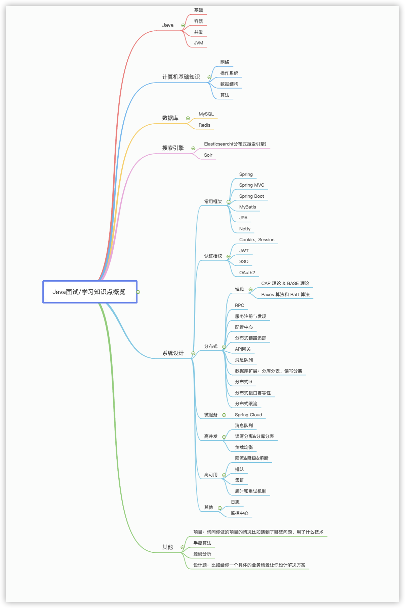

# 项目

介绍项目：

1. 对项目整体设计的一个感受（系统的架构图）
2. 在这个项目中负责了什么、做了什么、担任什么角色
3. 从这个项目中学会了哪些东西、使用到了哪些技术、学会了哪些新技术的使用
4. 如何协调项目组成员协同开发，如何解决棘手问题
5. 用了什么技术实现了什么功能，比如：优化数据库设计 减少冗余字段、用redis做缓存提高了访问速度、使用消息队列削峰和降流、服务拆分并集成了 dubbo 和 nacos 等等

# 技术准备

# 自我介绍

社招：

面试官，您好！我叫独秀儿。我目前有 1 年半的**工作经验**，熟练使用 Spring、MyBatis 等框架、了解 Java 底层原理比如 JVM 调优并且有着丰富的分布式开发经验。**离开上一家公司是因为我想在技术上得到更多的锻炼**。在上一个公司我**参与了一个分布式电子交易系统的开发**，**负责**搭建了整个项目的基础架构并且通过分库分表**解决了**原始数据库以及一些相关表过于庞大的问题，目前这个网站最高支持 10 万人同时访问。**工作之余**，我利用自己的业余时间写了一个简单的 RPC 框架，这个框架用到了 Netty 进行网络通信， 目前我已经将这个项目开源，在 Github 上收获了 2k 的 Star! 说到**业余爱好**的话，我比较喜欢通过博客整理分享自己所学知识，现在已经是多个博客平台的认证作者。 生活中我是一个比较积极乐观的人，一般会通过运动打球的方式来放松。**我一直都非常想加入贵公司，我觉得贵公司的文化和技术氛围我都非常喜欢，期待能与你共事！**

------

校招：

面试官，您好！我叫秀儿。大学时间我主要利用**课外时间**学习了 Java 以及 Spring、MyBatis 等框架 。**在校期间参与过一个考试系统的开发**，这个系统的主要用了 Spring、MyBatis 和 shiro 这三种框架。**我在其中主要担任后端开发，主要负责了权限管理功能模块的搭建**。另外，我在大学的时候参加过一次软件编程大赛，我和我的团队做的在线订餐系统成功获得了第二名的成绩。我还利用自己的业余时间写了一个简单的 RPC 框架，这个框架用到了 Netty 进行网络通信， 目前我已经将这个项目开源，在 Github 上收获了 2k 的 Star! 说到业余爱好的话，我比较喜欢通过博客整理分享自己所学知识，现在已经是多个博客平台的认证作者。 生活中我是一个比较积极乐观的人，一般会通过运动打球的方式来放松。我一直都非常想加入贵公司，我觉得贵公司的文化和技术氛围我都非常喜欢，期待能与你共事！

